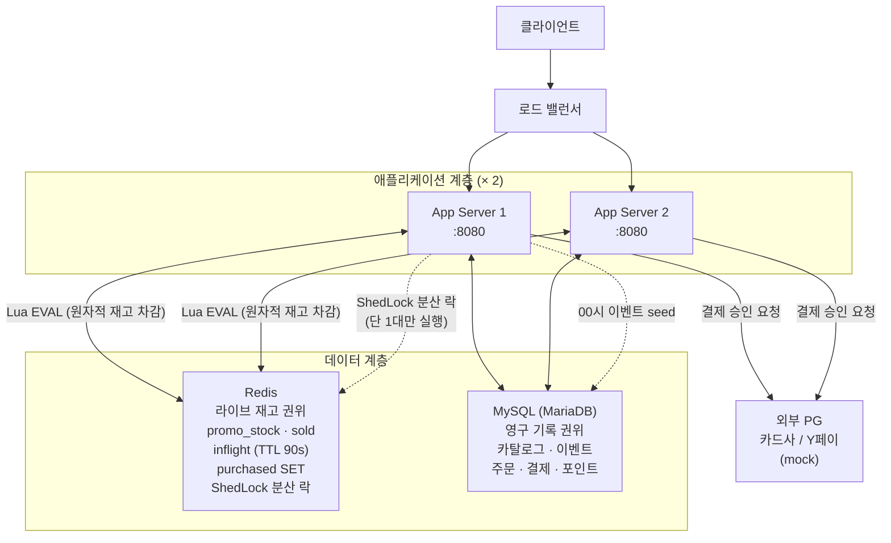
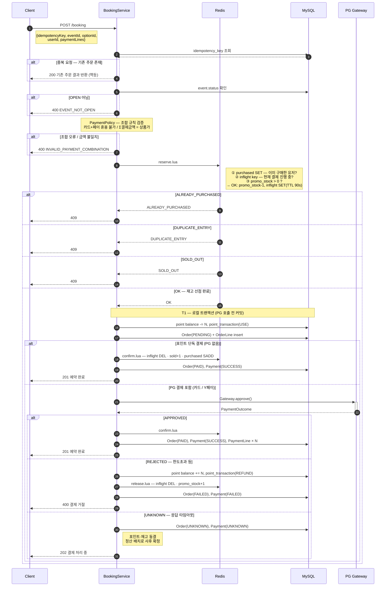
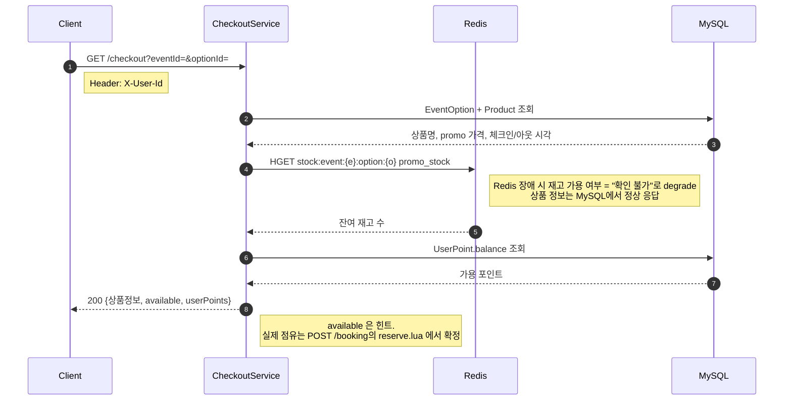
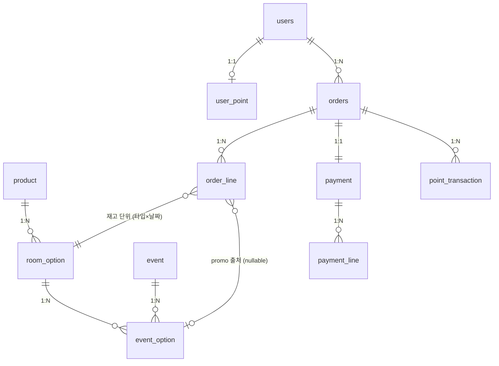
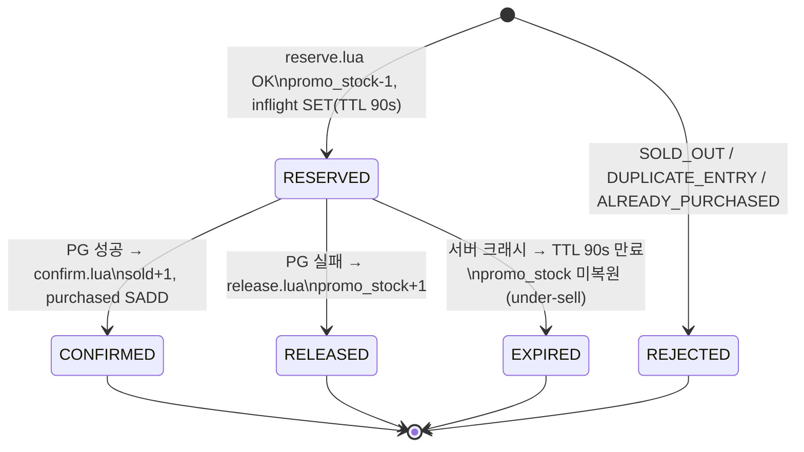
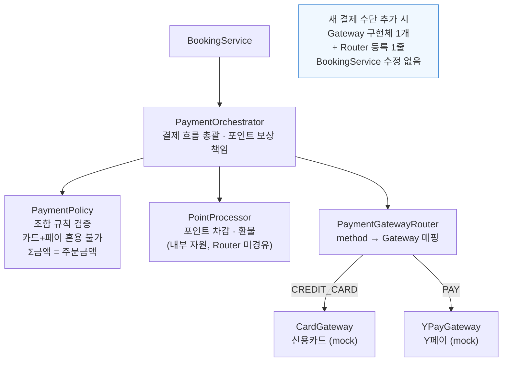
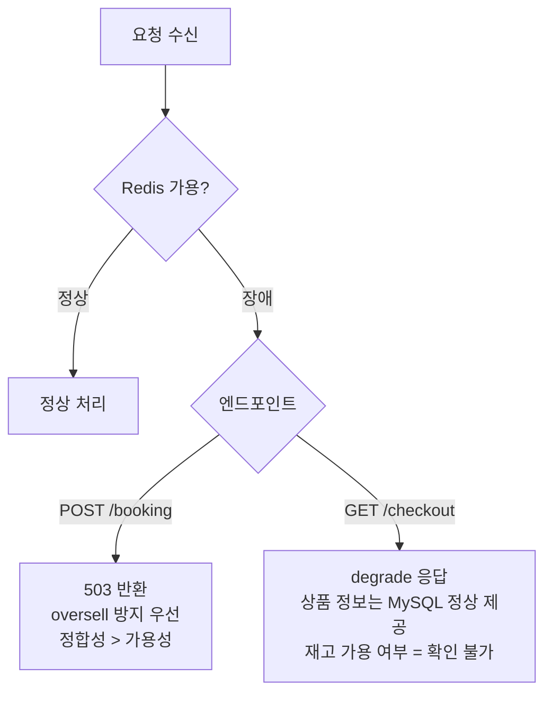

# booking-service

초특가 숙소 상품(10개 한정)에 대한 선착순 예약 시스템.
00시에 오픈되는 프로모션 상품을 분산 환경(앱 서버 2대 이상)에서 재고 정합성과 공정성을 보장하며 처리한다.

---

## 시스템 아키텍처



| 계층 | 권위 | 핵심 역할 |
|---|---|---|
| Redis | 라이브 재고 | Lua EVAL 원자 차감 — 앱 N대에서 추가 분산 락 불필요 |
| MySQL | 영구 기록 | 주문·결제·카탈로그 무결성 |
| ShedLock | 분산 스케줄러 락 | 00시 Redis 재고 시딩을 단 1대만 실행 보장 |

---

## 시퀀스 다이어그램

### POST /booking — 예약 및 결제 (핵심 흐름)



**흐름 핵심 요약**

| 단계 | 목적 |
|---|---|
| ① 멱등 체크 | 짧은 간격 중복 요청 → 기존 결과 즉시 반환 |
| ② reserve.lua (원자) | 1인 1구매 + oversell 방지. Redis 단일 EVAL → 분산 락 불필요 |
| ③ T1 (PG 전 커밋) | 포인트(내부) 먼저 차감. PG 실패 시 내부 보상만으로 정리 가능 |
| ④ confirm / release | PG 결과에 따라 sold 확정 또는 재고 복원 |
| ⑤ UNKNOWN 동결 | 타임아웃 ≠ 실패. 즉시 환불 시 이중 결제 위험 |

---

### GET /checkout — 주문서 조회



---

## 도메인 모델 (ERD)



**주문/결제 도메인 핵심 불변식**

```
Σ order_line.line_amount  =  orders.total_amount (gross)
                          =  Σ payment_line.amount
```

| 엔티티 | 역할 | 핵심 컬럼 |
|---|---|---|
| `orders` | 결제 트랜잭션 헤더 | `idempotency_key UNIQUE`, `status`, `total_amount` |
| `order_line` | 투숙 1건 (예약 종류 담당) | `room_option_id`, `event_option_id(NULL=일반)`, `nights`, `unit_price` |
| `payment` | PG 결과 기록 | `amount(net)`, `pg_tx_ref`, `status` |
| `payment_line` | 수단별 금액 내역 | `method(CREDIT_CARD·PAY·POINT)`, `amount` |
| `event_option` | 초특가 이벤트 옵션 | `promo_price`, `promo_stock_total(=10, Redis seed 원천)` |

---

## 재고 상태 전이



| 시나리오 | 결과 | 이유 |
|---|---|---|
| PG 성공 | confirm → sold 확정 | oversell 원천 차단 |
| PG 실패 | release → 재고 복원 | 보상 트랜잭션 |
| 서버 크래시 | TTL 만료 → under-sell | oversell보다 under-sell이 낫다 (운영 정리 가능) |

---

## 결제 컴포넌트 구조



**지원 결제 조합**

| 조합 | 허용 |
|---|---|
| 신용카드 단독 | ✅ |
| Y페이 단독 | ✅ |
| 포인트 단독 | ✅ |
| 신용카드 + 포인트 | ✅ |
| Y페이 + 포인트 | ✅ |
| 신용카드 + Y페이 | ❌ 혼용 불가 |

**PG 응답별 처리 전략**

| PG 응답 | 처리 |
|---|---|
| APPROVED | confirm → PAID |
| REJECTED (4xx, 한도초과) | 보상 후 FAILED. 재시도 무의미 |
| 5xx (PG 서버 오류) | Gateway 내부에서 2회 재시도 후 UNKNOWN |
| 응답 타임아웃 | UNKNOWN 동결. **재시도 금지** (이중 결제 위험) |

---

## Redis 장애 Fallback



**Redis 복구 시 재구성 방법**

| 항목 | 재구성 |
|---|---|
| `promo_stock` | `promo_stock_total − COUNT(orders WHERE status IN (PAID, PENDING))` |
| `sold` | `COUNT(orders WHERE status = PAID)` |
| `purchased` SET | PAID·PENDING 주문의 userId로 재구성 |
| `inflight` key | 재구성 안 함 (TTL 휘발 정보) |

PENDING까지 포함해 보수적 계산 → 최악이 under-sell, oversell은 0.

---

## 기술 스택

| 항목 | 선택 | 비고 |
|---|---|---|
| Language | Java 21 | |
| Framework | Spring Boot 3.4 | |
| RDB | MariaDB (MySQL 계열) | |
| Cache | Redis | 라이브 재고 권위 |
| 분산 스케줄러 락 | ShedLock 6.9 (Redis provider) | 00시 재고 시딩 중복 실행 방지 |
| ORM | Spring Data JPA (Hibernate) | |

---

## 실행 방법

> TODO: Docker Compose 구성 및 실행 명령 추가 예정

---

## API 목록

> TODO: Booking API 구현 후 추가 예정

| Method | Path | 설명 |
|---|---|---|
| GET | `/api/checkout` | 주문서 조회 (상품 정보 + 가용 재고 + 포인트 잔액) |
| POST | `/api/booking` | 결제 및 예약 완료 |
