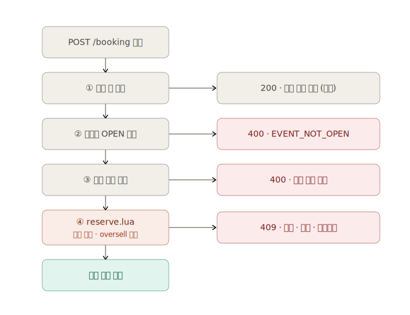
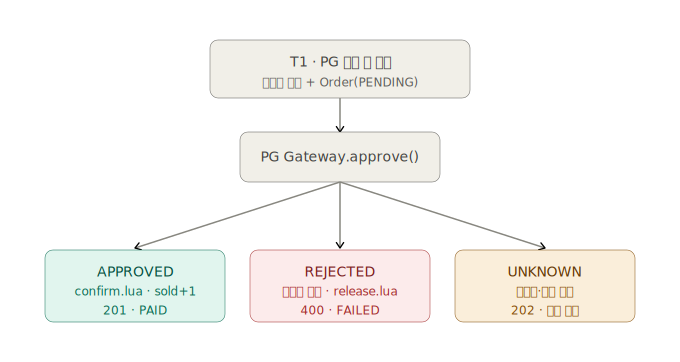
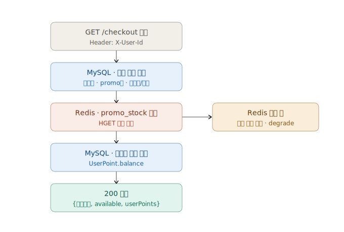
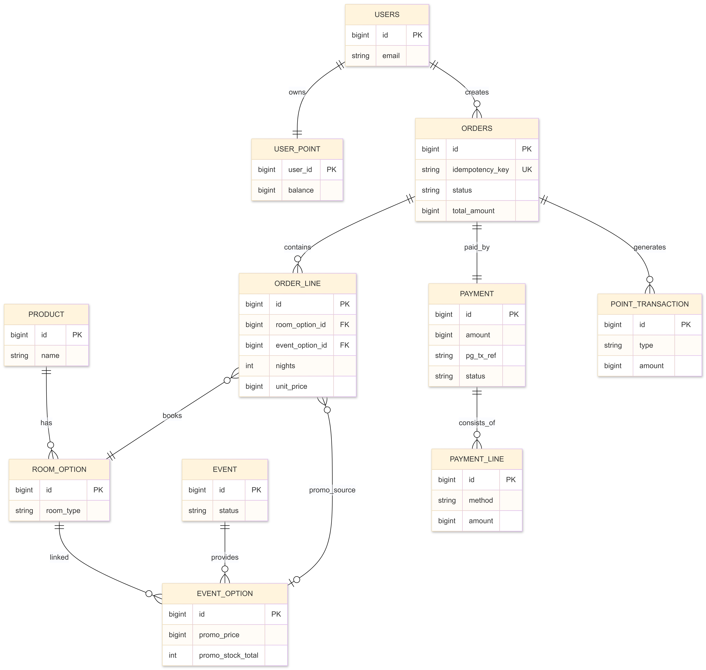
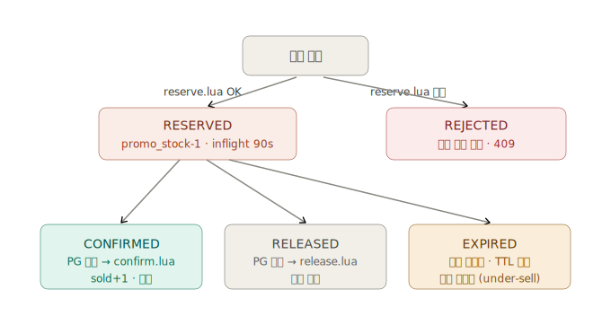
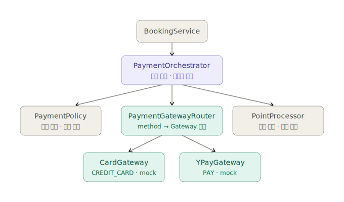
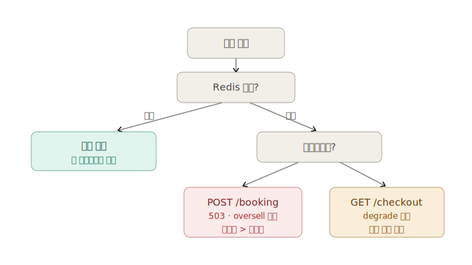

# booking-service

초특가 숙소 상품(10개 한정)에 대한 선착순 예약 시스템.
00시에 오픈되는 프로모션 상품을 분산 환경(앱 서버 2대 이상)에서 재고 정합성과 공정성을 보장하며 처리한다.

---

## 시스템 아키텍처



| 계층 | 권위 | 핵심 역할 |
|---|---|---|
| Redis | 라이브 재고 | Lua EVAL 원자 차감 — 앱 N대에서 추가 분산 락 불필요 |
| MySQL | 영구 기록 | 주문·결제·카탈로그 무결성 |
| ShedLock | 분산 스케줄러 락 | 00시 Redis 재고 시딩을 단 1대만 실행 보장 |

---

## 기술 스택

| 항목 | 선택 | 비고 |
|---|---|---|
| Language | Java 21 | |
| Framework | Spring Boot 3.4 | |
| RDB | MariaDB (MySQL 계열) | |
| Cache | Redis | 라이브 재고 권위 |
| 분산 스케줄러 락 | ShedLock 6.9 (Redis provider) | 00시 재고 시딩 중복 실행 방지 |
| ORM | Spring Data JPA (Hibernate) | |

---

## 실행 방법

**사전 요구 사항:** Docker Desktop (또는 Docker Engine + Compose v2), Java 21

```bash
# 1. 인프라 기동 (MySQL 8 + Redis 7)
docker compose up -d

# 2. 앱 실행
./gradlew bootRun
```

MySQL healthcheck 통과 후 Spring Boot가 `schema.sql`을 자동 실행하고 JPA validate를 수행한다.
접속: http://localhost:8080 / Swagger UI: http://localhost:8080/swagger-ui.html

> **시드 데이터 (local 프로파일)**
>
> | # | 상품명 | 오픈 시각 | 비고 |
> |---|---|---|---|
> | 1 | 디럭스 오션뷰 | 즉시 | 체크인 2026-06-15 |
> | 2 | 스탠다드 가든뷰 | 즉시 | 체크인 2026-06-20 |
> | 3 | 패밀리 스위트 | 즉시 | 체크인 2026-06-25 |
> | 4 | 프리미엄 스위트 | **기동 후 2분** | `EVENT_NOT_OPEN` → OPEN 전환 확인용 |
>
> - 이벤트 1~3은 앱 기동 시 `DataInitializer`가 Redis 시딩 + OPEN 전환까지 직접 처리해 즉시 예약 가능하다.
> - 이벤트 4는 `StockSeeder`(매분 0초 실행)가 2분 후 감지해 자동으로 Redis 시드 + OPEN 전환한다.
> - 유저 1,000명이 각 10,000 포인트를 보유한 상태로 생성된다.

### 부하 테스트 (k6)

macOS에서 k6를 직접 실행하면 `kern.ipc.somaxconn` 기본값(128) 제한으로 결과가 왜곡된다.
반드시 app과 k6를 동일한 Docker 네트워크에서 실행해야 한다.

```bash
# 1. jar 빌드
./gradlew build

# 2. app + 인프라 기동 (perf 프로파일 활성화)
docker compose --profile perf up -d

# 3. app healthy 확인 후 시나리오 실행
docker compose run --rm k6 run /scripts/s2_booking_spike.js

# 재실행 전 상태 초기화 (재고·주문·포인트 리셋)
bash scripts/k6/reset.sh
```

> **테스트 환경 (MSA 단일 파드 기준)**: app 2 CPU / 2G, mysql 1 CPU / 512M, redis 0.5 CPU / 256M
> 응답 시간은 환경에 따라 달라진다. **재고 정합성(`PAID ≤ 10`, 5xx = 0)이 핵심 검증 지표**다.

시나리오별 상세 설명 및 측정 결과는 [`docs/performance.md`](docs/performance.md) 참조.

---

## API 목록

| Method | Path | 설명 |
|---|---|---|
| GET | `/api/checkout` | 주문서 조회 (상품 정보 + 가용 재고 + 포인트 잔액) |
| POST | `/api/booking` | 결제 및 예약 완료 |

### GET /api/checkout

주문서 진입 시 상품 정보, 재고 가용 여부, 포인트 잔액을 조회한다.
`available` 필드는 GET 시점 힌트이며, 실제 재고 점유는 POST /api/booking 에서 확정된다.

**Request**

| 위치 | 이름 | 타입 | 필수 | 설명 |
|---|---|---|---|---|
| Header | `X-User-Id` | Long | ✅ | 사용자 ID |
| Query | `eventId` | Long | ✅ | 이벤트 ID |
| Query | `optionId` | Long | ✅ | 이벤트 옵션 ID |

**Response 200**

```json
{
  "success": true,
  "data": {
    "event": {
      "eventId": 1,
      "endsAt": "2025-01-01T00:30:00+09:00"
    },
    "product": {
      "name": "오션뷰 디럭스"
    },
    "option": {
      "optionId": 1,
      "checkInDate": "2025-01-15",
      "checkInTime": "15:00:00",
      "checkOutDate": "2025-01-16",
      "checkOutTime": "11:00:00",
      "promoPrice": 59000
    },
    "available": true,
    "userPoints": 20000
  }
}
```

**Error**

| HTTP | code | 설명 |
|---|---|---|
| 400 | `INVALID_INPUT` | 필수 파라미터 누락 |
| 404 | `EVENT_NOT_FOUND` | 이벤트 없음 |
| 404 | `EVENT_OPTION_NOT_FOUND` | 옵션 없음 |

---

### POST /api/booking

결제 수단과 금액을 입력받아 재고를 점유하고 결제를 완료한다.
`Idempotency-Key` 헤더로 중복 요청을 막는다.

**Request**

| 위치 | 이름 | 타입 | 필수 | 설명 |
|---|---|---|---|---|
| Header | `X-User-Id` | Long | ✅ | 사용자 ID |
| Header | `Idempotency-Key` | String | ✅ | 클라이언트 발급 멱등키 (UUID 권장) |
| Body | `eventId` | Long | ✅ | 이벤트 ID |
| Body | `optionId` | Long | ✅ | 이벤트 옵션 ID |
| Body | `paymentMethod` | String | - | PG 결제 수단. `CREDIT_CARD` \| `PAY`. Y_POINT 단독 결제 시 null |
| Body | `pointsToUse` | Long | ✅ | 포인트 사용액 (0 이상, 미사용 시 0) |
| Body | `paymentKey` | String | - | 프론트에서 발급받은 PG 토큰. PG 결제 수단 없으면 null |

**Response 200**

```json
{
  "success": true,
  "data": {
    "orderId": 42,
    "status": "PAID",
    "totalAmount": 59000
  }
}
```

**Error**

| HTTP | code | 설명 |
|---|---|---|
| 400 | `INVALID_PAYMENT_COMBINATION` | 결제 수단·포인트 조합 불일치 (PG 수단 없이 PG 금액 발생, 또는 그 역) |
| 400 | `PAYMENT_AMOUNT_MISMATCH` | 포인트 사용액이 상품가 초과 |
| 400 | `INSUFFICIENT_POINT` | 포인트 잔액 부족 |
| 400 | `PAYMENT_REJECTED` | PG 한도 초과 등 거절 |
| 409 | `SOLD_OUT` | 재고 소진 |
| 409 | `ALREADY_PURCHASED` | 동일 이벤트 중복 구매 |
| 409 | `DUPLICATE_ENTRY` | 동일 멱등키 요청이 결제 처리 중 (동시 중복) |
| 503 | `BOOKING_UNAVAILABLE` | Redis 일시 장애 — 재시도 필요 |

---

### DDL

전체 테이블 정의: [`src/main/resources/schema.sql`](src/main/resources/schema.sql)

---

## 테스트

| 테스트 클래스 | 방식 | 주요 검증 |
|---|---|---|
| `BookingFacadeTest` | Mockito 단위 | 해피패스 3종, 멱등성 4종(DB/Redis replay·중복·UNKNOWN), 보상 로직 4종 |
| `PaymentOrchestratorTest` | Mockito 단위 | PG APPROVED/REJECTED/UNKNOWN × 포인트 유무, 포인트 단독 결제 |
| `StockServiceIntegrationTest` | Testcontainers (Redis 7) | Lua 원자성(reserve·confirm·release), 동시성 50명 vs 재고 10개, release 멱등성 |

```bash
./gradlew test
```

## 시퀀스 다이어그램

### POST /booking — 예약 및 결제 (핵심 흐름)

#### 1단계 — 진입 검증 게이트



#### 2단계 — 결제 확정 처리



---

### GET /checkout — 주문서 조회



---

## 도메인 모델 (ERD)



**주문/결제 도메인 핵심 불변식**

```
Σ order_line.line_amount  =  orders.total_amount (gross)
                          =  Σ payment_line.amount
```

| 엔티티 | 역할 | 핵심 컬럼 |
|---|---|---|
| `orders` | 결제 트랜잭션 헤더 | `idempotency_key UNIQUE`, `status`, `total_amount` |
| `order_line` | 투숙 1건 (예약 종류 담당) | `room_option_id`, `event_option_id(NULL=일반)`, `nights`, `unit_price` |
| `payment` | PG 결과 기록 | `amount(net)`, `pg_tx_ref`, `status` |
| `payment_line` | 수단별 금액 내역 | `method(CREDIT_CARD·PAY·POINT)`, `amount` |
| `event_option` | 초특가 이벤트 옵션 | `promo_price`, `promo_stock_total(=10, Redis seed 원천)` |

---

## 재고 상태 전이



| 시나리오 | 결과 | 이유 |
|---|---|---|
| PG 성공 | confirm → sold 확정 | oversell 원천 차단 |
| PG 실패 | release → 재고 복원 | 보상 트랜잭션 |
| 서버 크래시 | TTL 만료 → under-sell | oversell보다 under-sell이 낫다 (운영 정리 가능) |

---

## 결제 컴포넌트 구조



**지원 결제 조합**

| 조합 | 허용 |
|---|---|
| 신용카드 단독 | ✅ |
| Y페이 단독 | ✅ |
| 포인트 단독 | ✅ |
| 신용카드 + 포인트 | ✅ |
| Y페이 + 포인트 | ✅ |
| 신용카드 + Y페이 | ❌ 혼용 불가 |

---

## Redis 장애 Fallback



Redis 장애 시 서킷 브레이커가 빠른 실패로 완화하고, Sentinel failover 완료 후 자동 복귀한다.
키 재구성 방법 및 설계 근거는 [DECISIONS.md — 쟁점 5](DECISIONS.md#쟁점-5-redis-sentinel--인프라-단-장애-자동-복구) 참조.

---
