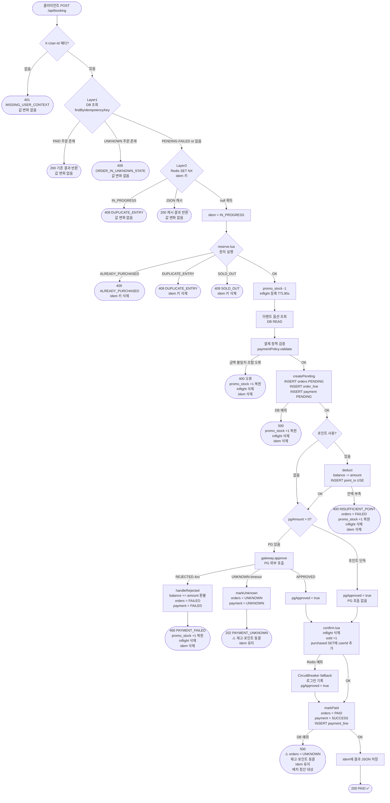

# Booking 전체 흐름 — 상태 변화 & 장애 시나리오

재고 정합성이 어떻게 유지되는지 각 단계에서 어떤 값이 바뀌는지를 추적한다.

---

## 추적 대상 상태값

| 상태값 | 저장소 | 초기값 | 의미 |
|---|---|---|---|
| `promo_stock` | Redis HASH | 10 | 남은 예약 가능 수량 |
| `inflight:E:O:U` | Redis Key (TTL 90s) | 없음 | 해당 유저 결제 진행 중 |
| `purchased:E` | Redis SET | 비어있음 | 이벤트에서 구매 완료한 userId 목록 |
| `idem:{key}` | Redis Key (TTL 24h) | 없음 | 멱등 키 상태 (IN_PROGRESS / JSON) |
| `orders.status` | MySQL | - | PENDING / PAID / FAILED / UNKNOWN |
| `payment.status` | MySQL | - | PENDING / SUCCESS / FAILED / UNKNOWN |
| `user_point.balance` | MySQL | N원 | 포인트 잔액 |

---

## 전체 흐름 다이어그램



---

## 단계별 상태 변화표 (Happy Path)

> 초기 상태: promo_stock=10, inflight=없음, purchased=비어있음, idem=없음

| # | 단계 | promo_stock | inflight | purchased | idem | orders | payment | point.balance |
|---|---|---|---|---|---|---|---|---|
| 0 | 초기 | 10 | ✗ | ✗ | ✗ | - | - | N원 |
| 1 | SET NX 획득 | 10 | ✗ | ✗ | IN_PROGRESS | - | - | N원 |
| 2 | reserve.lua OK | **9** | **✓ TTL90s** | ✗ | IN_PROGRESS | - | - | N원 |
| 3 | createPending | 9 | ✓ | ✗ | IN_PROGRESS | **PENDING** | **PENDING** | N원 |
| 4 | deduct (포인트 사용 시) | 9 | ✓ | ✗ | IN_PROGRESS | PENDING | PENDING | **N-P원** |
| 5 | gateway.approve (PG 승인) | 9 | ✓ | ✗ | IN_PROGRESS | PENDING | PENDING | N-P원 |
| 6 | confirm.lua | 9 | **✗** | **✓(userId)** | IN_PROGRESS | PENDING | PENDING | N-P원 |
| 7 | markPaid | 9 | ✗ | ✓ | IN_PROGRESS | **PAID** | **SUCCESS** | N-P원 |
| 8 | idem setResult | 9 | ✗ | ✓ | **JSON** | PAID | SUCCESS | N-P원 |

sold 카운터: confirm.lua에서 +1 (sold = 1)  
최종 정합성: `promo_stock(9) + sold(1) = 10` ✅

---

## 장애 시나리오별 최종 상태

### 시나리오 A — PG 호출 전 실패 (재시도 안전 구간)

| 실패 지점 | promo_stock | inflight | purchased | orders | point.balance | 재시도 가능? |
|---|---|---|---|---|---|---|
| reserve.lua SOLD_OUT | 10 (변화 없음) | ✗ | ✗ | - | 변화 없음 | - (재고 없음) |
| createPending DB 예외 | **10 복원** | **✗ 삭제** | ✗ | - | 변화 없음 | ✅ |
| deduct 잔액 부족 | **10 복원** | **✗ 삭제** | ✗ | **FAILED** | 변화 없음 | ✅ (충전 후) |
| PG REJECTED | **10 복원** | **✗ 삭제** | ✗ | **FAILED** | **N원 환불** | ✅ |

→ `pgApproved = false` 경로: 보상 완료, 재고 정합성 유지

---

### 시나리오 B — PG 승인 후 실패 (동결 구간)

| 실패 지점 | promo_stock | inflight | purchased | orders | point.balance | 처리 |
|---|---|---|---|---|---|---|
| PG timeout | 9 (차감 유지) | ✓ (TTL 대기) | ✗ | **UNKNOWN** | N-P원 (동결) | 배치 정산 |
| confirm.lua Redis 장애 | 9 (차감 유지) | TTL 만료 대기 | ✗ (미등록) | PENDING | N-P원 | 배치 정산 |
| markPaid DB 예외 | 9 (차감 유지) | ✗ (confirm 완료) | **✓** | **UNKNOWN** | N-P원 (동결) | 배치 정산 |

→ `pgApproved = true` 경로: 재고·포인트 건드리지 않음, UNKNOWN으로 동결

---

### 시나리오 C — Redis 장애 (서킷 브레이커 작동)

| 상황 | 동작 | 재고 정합성 |
|---|---|---|
| reserve() 시 Redis 장애 | CircuitBreaker → 503 반환 (fail-closed) | ✅ 보장 (예약 자체 차단) |
| confirm() 시 Redis 장애 | CircuitBreaker fallback → 로그만, 예외 없음 | ⚠️ purchased 미등록, TTL 후 under-sell |
| release() 시 Redis 장애 | CircuitBreaker fallback → 로그만 | ⚠️ promo_stock 미복원, under-sell |

under-sell은 허용 범위 (DECISIONS.md 쟁점 3). oversell은 어떤 경우에도 발생하지 않음.

---

### 시나리오 D — inflight TTL 만료 (서버 크래시)

```
reserve.lua → promo_stock 9, inflight 등록 (TTL 90s)
서버 크래시 → confirm/release 미호출
90초 후 → inflight TTL 만료

결과:
  promo_stock = 9  (복원 안 됨 → under-sell 1개)
  purchased   = 비어있음 (해당 userId 없음 → 재구매 가능)
  orders      = PENDING 잔류 (배치 운영 정리 대상)
```

→ oversell 불가 (promo_stock은 이미 차감된 상태로 고정)  
→ under-sell 1개 발생 (운영 정리 가능)

---

### 시나리오 E — 멱등성 재진입

| 재시도 시점 | Layer 1 (DB) | Layer 2 (Redis) | 결과 |
|---|---|---|---|
| PAID 완료 후 재시도 | PAID 발견 → 즉시 반환 | 미진입 | 200 캐시 반환 |
| IN_PROGRESS 중 동시 요청 | 없거나 PENDING fall-through | IN_PROGRESS 발견 | 409 DUPLICATE_ENTRY |
| Redis TTL 만료 후 재시도 | PAID 발견 → 즉시 반환 | 미진입 | 200 DB에서 재구성 |
| Redis 장애 후 재시도 | PAID 발견 → 즉시 반환 | 장애로 null → 진입 | DB UNIQUE가 최후 차단 |

---

## 재고 정합성 불변식

```
언제나 성립해야 하는 조건:
  promo_stock + sold + inflight_count ≤ promo_stock_total(10)

정상 운영 시:
  promo_stock(남은 수량) + sold(확정) + inflight(진행중) = 10

서버 크래시 후 (TTL 만료):
  promo_stock + sold ≤ 10   (under-sell 가능, oversell 불가)

Redis 재구성 시:
  promo_stock = 10 - COUNT(orders WHERE status IN (PAID, PENDING, UNKNOWN))
```
