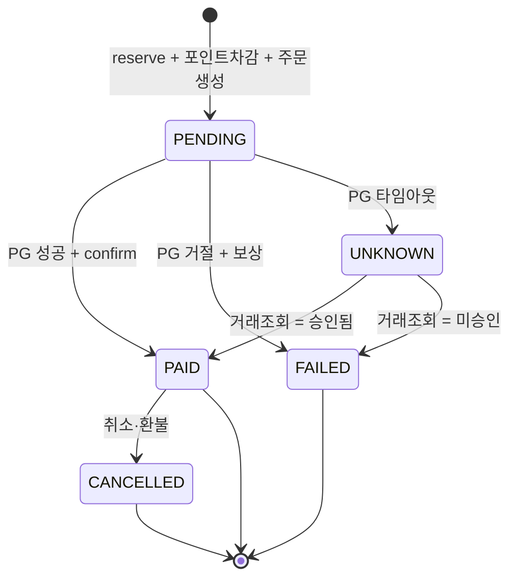
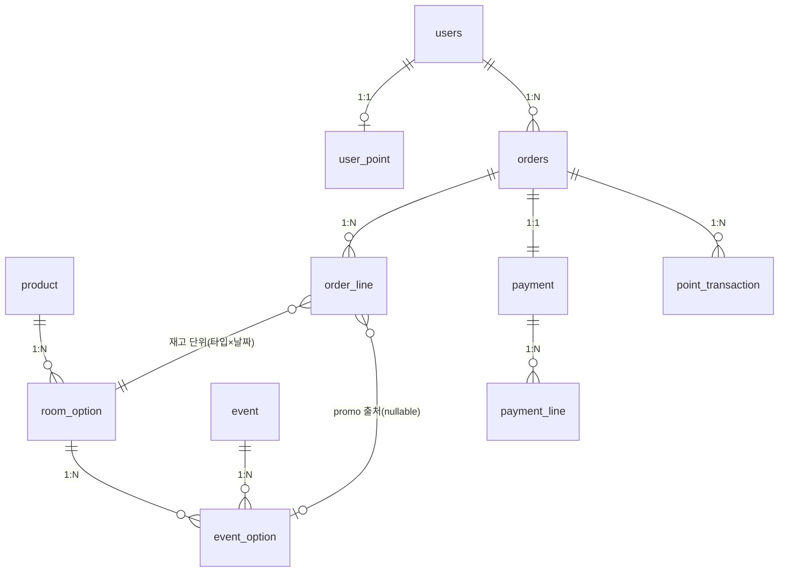

# 상품 및 도메인 설계 (Domain Design)

> **한 줄 요약** — 표준 이커머스 카탈로그(`Product → RoomOption → Event → EventOption`) 위에 주문·결제·포인트를 얹는 구조. 실시간 재고(Redis·Lua)는 stock-design.md, 결제 흐름 상세는 payment-design.md 참조.

---

## 도메인 구성

```
┌──────────────────┐  ┌──────────────────┐  ┌──────────────────┐  ┌──────────────────┐
│    상품 구조      │  │      주문         │  │      결제         │  │     포인트        │
├──────────────────┤  ├──────────────────┤  ├──────────────────┤  ├──────────────────┤
│ Product          │  │ Order            │  │ Payment          │  │ UserPoint        │
│ RoomOption       │  │ OrderLine        │  │ PaymentLine      │  │ PointTransaction │
│ Event            │  │                  │  │                  │  │                  │
│ EventOption      │  │                  │  │                  │  │                  │
└────────┬─────────┘  └────────┬─────────┘  └──────────────────┘  └──────────────────┘
         │ 상품 정보 제공        │ 1:1
         └──────────────────────┘
```

예약 흐름:

```
상품에서 옵션 선택 → Order + OrderLine 생성 → Payment + PaymentLine 기록
                                                          ↑
                                               포인트 차감 선행 (PG 호출 전)
```

---

## 상품 구조

```
Product → RoomOption  (객실타입 + 체크인날짜 + 1박 고정)
        ↘ Event → EventOption  (promo 슬롯, 00시 오픈 단위)
```

- 재고는 옵션(RoomOption) 단위로 존재. promo(초특가) 이벤트 재고가 일반 판매 재고와 겹치는 문제를 막기 위해 이벤트 상품은 1박 고정 + promo(초특가) 재고를 `EventOption.promo_stock_total`에 별도 격리
- 평시 재고(`stock`)와 promo(초특가) 재고(`promo_stock_total`) 분리 — 평시 손님이 promo(초특가) 재고 잠식 차단
- 평시 구매 API 미구현 (과제 범위 밖). `stock` 컬럼은 카탈로그 사실성을 위해 보유

---

## 주문

```
Order (결제 트랜잭션 헤더)       OrderLine (투숙 1건)
  idempotency_key          →     room_option_id
  status                         event_option_id (nullable, promo면 채워짐)
  total_amount (gross)           unit_price 스냅샷 · nights
```

- `total_amount` = gross(상품가 전체). `Σ payment_line.amount = total_amount` 불변식 성립
- status: `PENDING → PAID / FAILED / UNKNOWN / CANCELLED`
- `idempotency_key` UNIQUE = 멱등성 최후 보루
- Order는 예약 종류 모름 — OrderLine의 `event_option_id` nullable로 promo/일반 구분



### OrderLine 확장 경로

| 예약 종류 | event_option_id | nights | 비고 |
|---|---|---|---|
| 이벤트 1박 (현재 구현) | 채워짐 | 1 | promo 재고 경로 |
| 일반 1박 | NULL | 1 | 구조 변경 없이 지원 가능 |
| 일반 연박 | NULL | N | reserve 루프 확장만 필요 |

`check_out_date`는 `check_in_date + nights`로 결정론적 파생이므로 DB Generated Column 처리. 수동 저장 시 드리프트 위험 존재.

날짜별 가격·취소·정산이 필요해질 때 `OrderLineNight` 추가:

```
Order
 └── OrderLine (체크인~아웃, nights, 스냅샷)
       └── OrderLineNight (박별 room_option_id, stayDate, amount)  ← 추후 추가
```

---

## 결제

```
Payment (PG 관점)         PaymentLine (수단별 1행)
  amount (net)       →    CREDIT_CARD / PAY / POINT
  status                  Σ amount = orders.total_amount
```

- 포인트 먼저 차감 → PG 마지막 호출. PG 취소(외부 호출) 없이 내부 보상만으로 정리 가능
- `payment.amount` = net(PG 청구분). gross는 `orders.total_amount`가 담음
- `PaymentLine`으로 복합결제 지원 (카드+포인트, 페이+포인트 등)

---

## 포인트

```
UserPoint          PointTransaction (flat 이력)
  balance     +      type: USE | REFUND
                     lot / 만료 추적 없음
```

- `balance` + flat 이력만 유지. lot별 FIFO 차감 불필요 (적립·만료 범위 밖)
- `SUM(USE) − SUM(REFUND) = balance` 델타로 정합성 검증 가능
- 잔액 부족 시 PG 호출 전 즉시 중단 — 차감 시도 자체가 잔액 검증

---

## 시간/날짜 모델링

체크인/아웃은 숙소 현지 벽시계 시각이지 절대 순간(instant)이 아님. "체크인 15:00"은 숙소 현지 오후 3시. 이벤트 오픈·결제 시각은 진짜 순간.

| 값 | 종류 | 타입 |
|---|---|---|
| 체크인 날짜 | 달력 날짜 | `LocalDate` |
| 체크인/아웃 시각 | 벽시계 시각 | `LocalTime` |
| 체크아웃 날짜 | 파생 (1박 고정 → 체크인+1일) | 응답에서 계산, 저장 안 함 |
| 이벤트 오픈/생성/결제 시각 | 순간(instant) | `ZonedDateTime` (Asia/Seoul) |

체크아웃 날짜를 저장하지 않는 이유: 1박 고정이라 `checkInDate + 1`로 자명. 저장 시 두 값 불일치 가능성 존재.

"6월 12일 체크인"이 어느 나라 날짜인지는 숙소(Product)의 타임존이 결정. `Product.timezone`(IANA)을 두고 `RoomOption.hotelZone()`으로 파생. 현재 서비스는 한국 단일이라 default가 `Asia/Seoul`이지만, 글로벌 숙소 추가 시 필드 값만 변경으로 대응 가능.

---

## 상세 명세

> 시각 컬럼 `created_at` / `updated_at`(`DATETIME(6)`) 전 엔티티 공통 보유.

#### ERD



#### 상품 구조

**Product** `id · name · timezone(IANA, default: Asia/Seoul)`

**RoomOption** `product_id(FK) · check_in_date(DATE) · check_in_time · check_out_time · base_price(BIGINT) · stock(INT)`
- UNIQUE(product_id, check_in_date)

**Event** `id · name · starts_at · ends_at · status`
- status: SCHEDULED | OPEN | CLOSED

**EventOption** `event_id(FK) · option_id(FK) · promo_price(BIGINT) · promo_stock_total(INT)`
- UNIQUE(event_id, option_id) / promo_stock_total = 초기 할당량(10), 라이브 잔여 아님

#### 주문/결제

**orders** `user_id(FK) · idempotency_key · status · total_amount(gross)`
- UNIQUE(idempotency_key)

**order_line** `order_id(FK) · room_option_id(FK) · event_option_id(FK, nullable) · check_in_date · nights · unit_price · line_amount`
- check_out_date = DB Generated Column (check_in_date + nights)
- 현재 nights = 1 고정

**payment** `order_id(FK) · status · amount(net) · pg_tx_ref · fail_reason`
- UNIQUE(order_id)

**payment_line** `payment_id(FK) · method · amount`
- method: CREDIT_CARD | PAY | POINT

#### 포인트

**user_point** `user_id(PK,FK) · balance(BIGINT)`

**point_transaction** `user_id · order_id(FK) · type · amount`
- type: USE | REFUND

#### Enum

| 컬럼 | 값 |
|---|---|
| `event.status` | `SCHEDULED`, `OPEN`, `CLOSED` |
| `orders.status` | `PENDING`, `PAID`, `FAILED`, `UNKNOWN`, `CANCELLED` |
| `payment.status` | `PENDING`, `SUCCESS`, `FAILED`, `UNKNOWN`, `REFUNDED` |
| `payment_line.method` | `CREDIT_CARD`, `PAY`, `POINT` |
| `point_transaction.type` | `USE`, `REFUND` |
