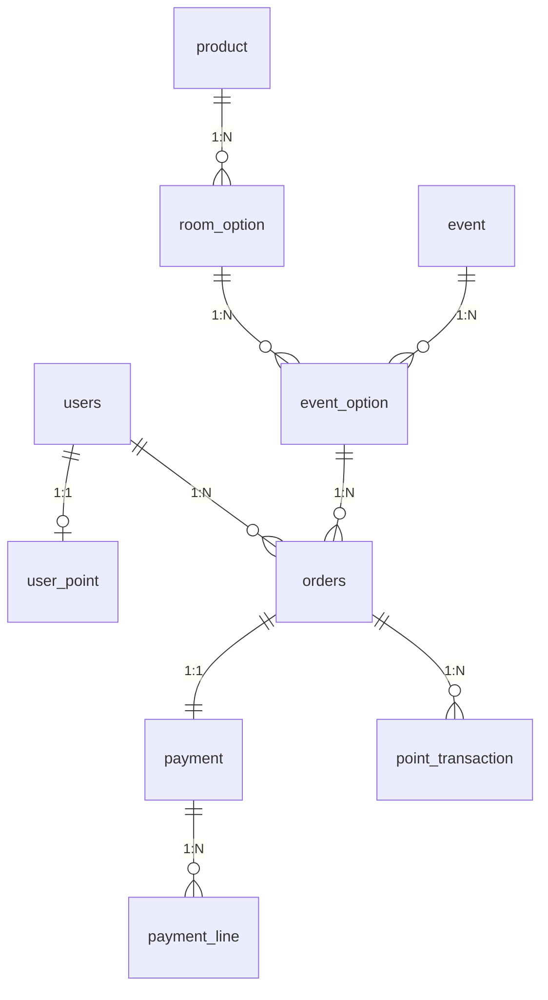
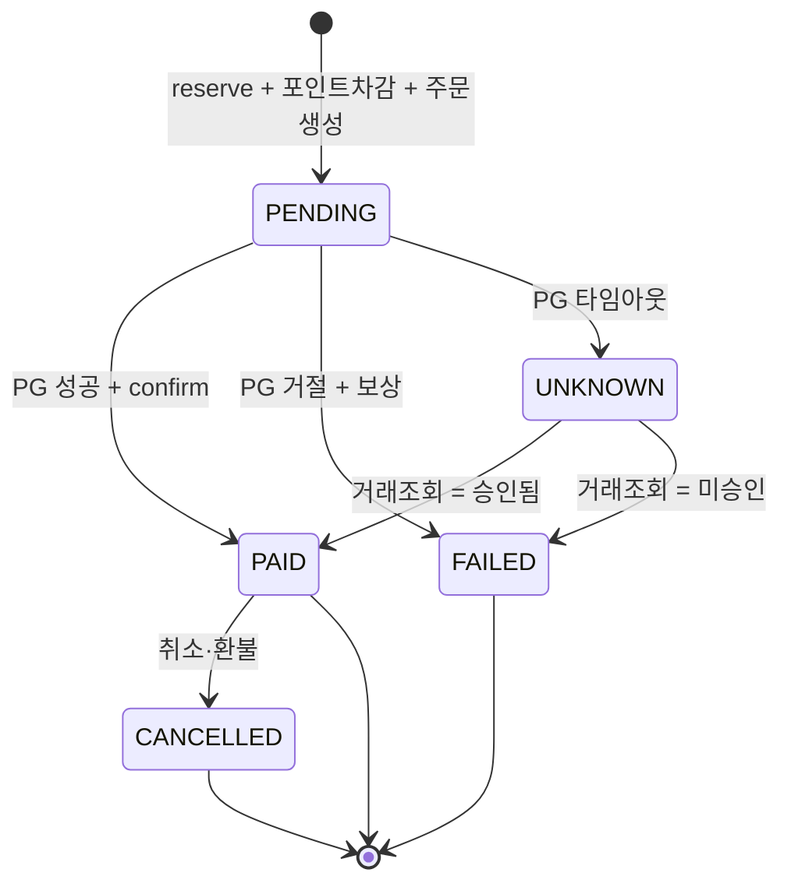

# 상품 및 도메인 설계 (Domain Design)

> **한 줄 요약** — 표준 이커머스 카탈로그(`Product → RoomOption → Event → EventOption`) 위에 주문·결제·포인트를 얹는다. 모든 큰 결정의 기준은 [`ASSIGNMENT.md`](ASSIGNMENT.md), 원칙은 **오버엔지니어링 금지 / 일반적인 이커머스 구조**다.

이 문서는 MySQL에 영속되는 도메인 모델의 단일 원천이다. 재고의 실시간 메커니즘(Redis·Lua)은 별도 재고 설계 문서에서 다루고, 여기서는 모델·관계·필드·상태·근거만 확정한다.

---

## 1. 설계 원칙

| # | 원칙 |
|---|---|
| 1 | 일반적인 이커머스 카탈로그 구조를 따른다 (상품 → 옵션 → 이벤트 → 이벤트옵션) |
| 2 | 인증·로그인은 평가 범위 밖 → `users`는 식별용 최소 컬럼만 |
| 3 | 돈 = `BIGINT`(원, KRW), 수량 = `INT`. 합계 오버플로 원천 차단 |
| 4 | 실시간 재고 카운터는 MySQL에 두지 않는다. DB엔 "초기 할당량"(`promo_stock_total`)만 영속 |
| 5 | 적립·만료·lot 같은 로열티 기능은 도입하지 않는다 (범위 밖). 포인트는 "조회 + 결제수단"으로만 |

---

## 2. 도메인 모델

### 2.1 엔티티 관계 (ERD)



### 2.2 카탈로그 구조

```
Product (객실타입)
  └── 1:N ─> RoomOption (객실타입 + 체크인 날짜 + 1박 고정)
               ├── base_price   ← 평시 가격
               └── stock        ← 평시 재고 (promo 할당분 제외 잔여)

Event (프로모션 슬롯, 00시 오픈 단위)
  └── 1:N ─> EventOption ─> RoomOption (FK)
               ├── promo_price        ← 초특가
               └── promo_stock_total  ← 초기 한정 재고(=10), 이벤트 시작 시 Redis seed 원천
```

- **옵션 단위** = (객실타입, 체크인 날짜, 1박 고정). 연박 예약 불가.
- **이벤트 ↔ 옵션** = `EventOption` 명시 매핑(범위 필터 X). FK로 옵션 존재 보장, 검증 O(1).
- **"10개 한정"의 약속** = `EventOption.promo_stock_total`에 격리.

### 2.3 평시 재고 vs promo 재고 분리

이벤트 시작 전, 옵션의 평시 재고에서 promo 재고를 떼어둔다.

```
RoomOption(6/15) stock=50  →  stock=40  +  EventOption.promo_stock_total=10
```

근거: 평시 손님이 promo 재고를 잠식하거나 그 반대를 차단하고, "10개 한정"을 `EventOption`에 격리한다. 평시 판매 흐름 자체는 이 과제 범위가 아니므로 `stock` 컬럼은 카탈로그 사실성을 위해 보유하되 평시 구매 API는 구현하지 않는다.

---

## 3. 시간/날짜 모델링

체크인/아웃은 **숙소 현지 벽시계 시각**이지 절대 순간(instant)이 아니다. "체크인 15:00"은 사용자가 어디 있든 숙소 현지 오후 3시다. 반면 이벤트 오픈·결제 시각은 진짜 순간이다.

| 값 | 종류 | 타입 |
|---|---|---|
| 체크인 날짜 | 달력 날짜 | `LocalDate` |
| 체크인/아웃 시각 | 벽시계 시각 | `LocalTime` |
| 체크아웃 날짜 | 파생 (1박 고정 → 체크인+1일) | 응답에서 계산, 저장 안 함 |
| 이벤트 오픈/생성/결제 시각 | 순간(instant) | `ZonedDateTime` (Asia/Seoul) |

체크아웃 날짜를 저장하지 않는 이유: 1박 고정이라 `checkInDate + 1`로 자명. 저장하면 두 값이 어긋날 여지만 생긴다.

---

## 4. 포인트 설계 — flat 이력(Lv1)

포인트는 이 시스템에서 **(1) 가용 잔액 조회 (2) 결제수단(단독·복합)**으로만 쓰인다. 적립·만료·lot 차감·source 추적은 범위 밖이다.

그래서 적립형 포인트의 정석인 `point_event` + `point_detail`(lot별 적립·만료·FIFO 차감 추적)은 **이 도메인엔 과하다.** 대신:

- `user_point.balance` — 현재 잔액
- `point_transaction` — `USE` / `REFUND` **flat 이력** (lot 추적 없음)

이력 한 장으로 `SUM(USE) − SUM(REFUND)` ↔ `balance` 델타를 대조해 정합성을 검증할 수 있다. point_detail이 필요한 lot FIFO 복잡성은 없다.

차감 순서 — **내부 먼저, 외부 나중**:

되돌리기 쉬운 포인트(내부 DB)를 **먼저** 차감하고, 되돌리기 어려운 PG(카드/Y페이, 외부)를 **마지막에** 호출한다. PG는 취소하려면 외부 호출(취소 요청)이 또 필요하고 그마저 실패할 수 있으므로, 되돌릴 일이 생기면 항상 **내부 자원만** 되돌리도록 순서를 고정한다. 이 순서 덕에 PG 취소를 부를 경로가 구조적으로 없다.

- **차감**: 재고 선점 후 **PG 호출 전에** 로컬 트랜잭션(T1)에서 `balance -= used` + `point_transaction(USE)` + 주문 `PENDING` insert를 함께 커밋. 포인트가 맨 먼저라 **잔액 부족이면 PG 호출 전에 즉시 중단**된다 (별도 사전 잔액 검증 단계가 필요 없다 — 차감 자체가 검증).
- **복원(보상)**: PG가 실패(한도 초과 등)하면 앞서 차감한 포인트를 환불 — `balance += used` + `point_transaction(REFUND)`. 포인트 단독 결제(PG 없음)면 보상 경로 자체가 없다.
- **멱등**: 같은 `idempotency_key` 재요청은 새로 차감하지 않고 **기존 주문 결과를 그대로 반환**한다. `orders.idempotency_key` UNIQUE가 최후 보루.

---

## 5. 주문/결제 상태

PG 승인 결과 불명(타임아웃)을 표현하려면 `UNKNOWN`이, 환불을 표현하려면 `CANCELLED`/`REFUNDED`가 필요하다. 주문은 서비스 관점, 결제는 PG 관점이라 어휘가 갈린다.

| 매핑 | 주문(orders) | 결제(payment) |
|---|---|---|
| 결제 완료 | `PAID` | `SUCCESS` |
| 환불 마감 | `CANCELLED` | `REFUNDED` |
| 결과 불명 | `UNKNOWN` | `UNKNOWN` |



`event.status`(`SCHEDULED | OPEN | CLOSED`)는 시간 파생 대신 명시 컬럼으로 둔다. "오픈 여부" 질의가 단순하고 운영 제어가 명확하기 때문이다.

---

## 6. 금액 규칙 — total_amount = gross

`orders.total_amount`는 **상품 총액(gross)**을 담는다. PG에 실제 청구한 현금분은 `payment.amount`(net)가 따로 들고 있다.

예) 상품가 100,000을 포인트 30,000 + 카드 70,000으로 결제:

```
payment_line:  POINT 30,000 / CREDIT_CARD 70,000   → Σ = 100,000
orders.total_amount = 100,000 (gross)
payment.amount      =  70,000 (PG 청구분, net)
```

불변식 `Σ payment_line = orders.total_amount`가 한 줄로 성립한다. net(현금분)을 담으면 주문 금액만으로 상품가를 알 수 없고 payment_line 합과도 어긋나 검증이 꼬인다.

---

## 7. 엔티티 명세

> 시각 컬럼은 `created_at` / `updated_at`(`DATETIME(6)`) 공통. 아래 표는 핵심 컬럼만.

### 7.1 카탈로그

| 엔티티 | 핵심 컬럼 | 비고 |
|---|---|---|
| **users** | `id`, `name` | 인증 범위 밖 → 식별용 최소 컬럼만 (email/password/role 없음) |
| **product** | `id`, `name` | 객실타입 |
| **room_option** | `product_id(FK)`, `check_in_date(DATE)`, `check_in_time(TIME)`, `check_out_time(TIME)`, `base_price(BIGINT)`, `stock(INT)` | 옵션=객실타입+날짜+1박. `UNIQUE(product_id, check_in_date)` |
| **event** | `id`, `name`, `starts_at`, `ends_at`, `status` | `status`: SCHEDULED\|OPEN\|CLOSED |
| **event_option** | `event_id(FK)`, `option_id(FK)`, `promo_price(BIGINT)`, `promo_stock_total(INT)` | `UNIQUE(event_id, option_id)`. promo_stock_total = 초기 할당량(=10), 라이브 잔여 아님 |

### 7.2 주문/결제 (핵심)

| 엔티티 | 핵심 컬럼 | 비고 |
|---|---|---|
| **orders** | `event_option_id(FK)`, `user_id(FK)`, `idempotency_key`, `status`, `total_amount(gross)` | `UNIQUE(idempotency_key)` = 멱등성 최후 보루. status: PENDING\|PAID\|FAILED\|UNKNOWN\|CANCELLED |
| **payment** | `order_id(FK)`, `status`, `amount(net)`, `pg_tx_ref`, `fail_reason` | 주문:결제 = 1:1. `UNIQUE(order_id)`. status: PENDING\|SUCCESS\|FAILED\|UNKNOWN\|REFUNDED |
| **payment_line** | `payment_id(FK)`, `method`, `amount` | 복합결제 수단별 1행. method: CREDIT_CARD\|PAY\|POINT. 결제 확장성의 데이터 토대 |
| **user_point** | `user_id(PK,FK)`, `balance(BIGINT)` | 잔액 |
| **point_transaction** | `user_id`, `order_id(FK)`, `type`, `amount` | flat 이력. type: USE\|REFUND. lot/만료 없음 |

### 7.3 도메인 enum

| 컬럼 | 값 |
|---|---|
| `event.status` | `SCHEDULED`, `OPEN`, `CLOSED` |
| `orders.status` | `PENDING`, `PAID`, `FAILED`, `UNKNOWN`, `CANCELLED` |
| `payment.status` | `PENDING`, `SUCCESS`, `FAILED`, `UNKNOWN`, `REFUNDED` |
| `payment_line.method` | `CREDIT_CARD`, `PAY`, `POINT` |
| `point_transaction.type` | `USE`, `REFUND` |

---

## 8. 결정 요약

| # | 쟁점 | 결정 | 한 줄 근거 |
|---|---|---|---|
| D1 | users 테이블 | 최소(id+name) | 인증 범위 밖, FK 무결성·시드만 확보 |
| D2 | 포인트 모델 | balance + point_transaction(flat) | 적립/만료 없음 → point_event/detail은 과함, 이력 1장으로 정합성 대조 |
| D3 | 상태 어휘 | UNKNOWN+CANCELLED/REFUNDED 포함 | PG 타임아웃·환불을 정확히 표현 |
| D4 | total_amount | gross(상품가) | `Σpayment_line = total_amount` 불변식이 깔끔 |
| D5 | event.status | 명시 컬럼 | 시간 파생보다 질의·운영 제어 단순 |
| — | 평시/promo 재고 | 분리 | "10개 한정"을 EventOption에 격리 |

> 실시간 재고 차감(reserve/confirm/release)·1인 1구매 락·Redis 키 구조는 재고 설계 문서에서 별도로 다룬다.
