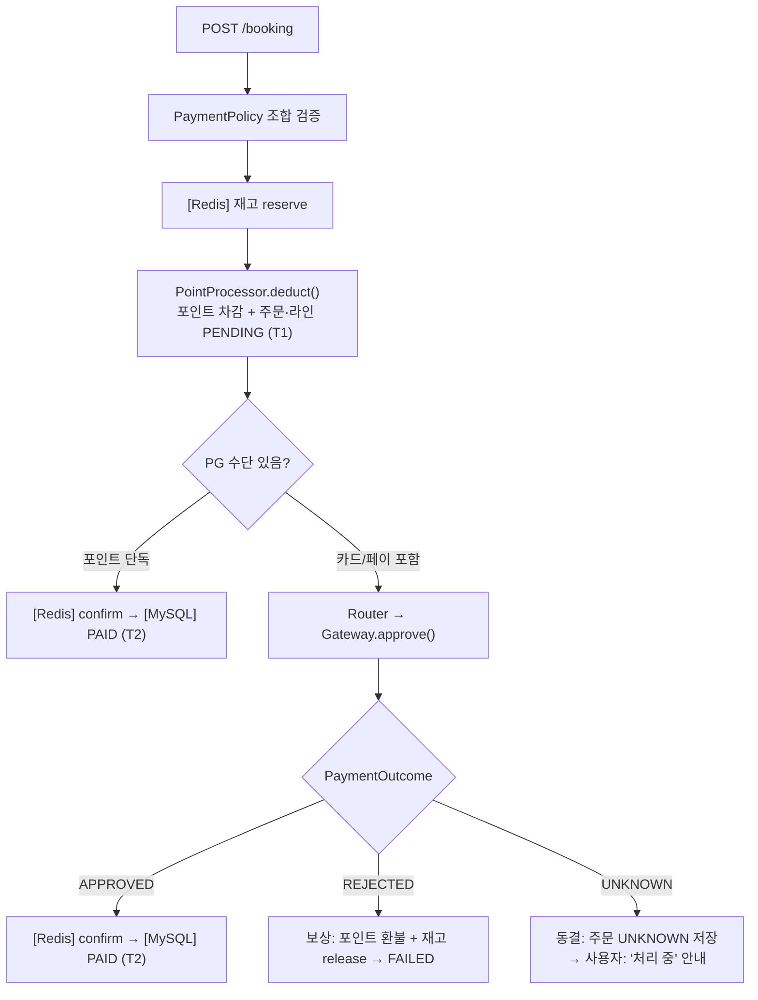
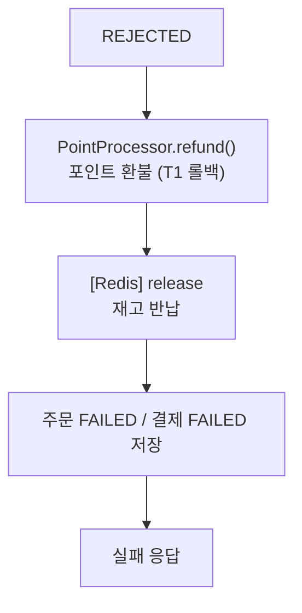
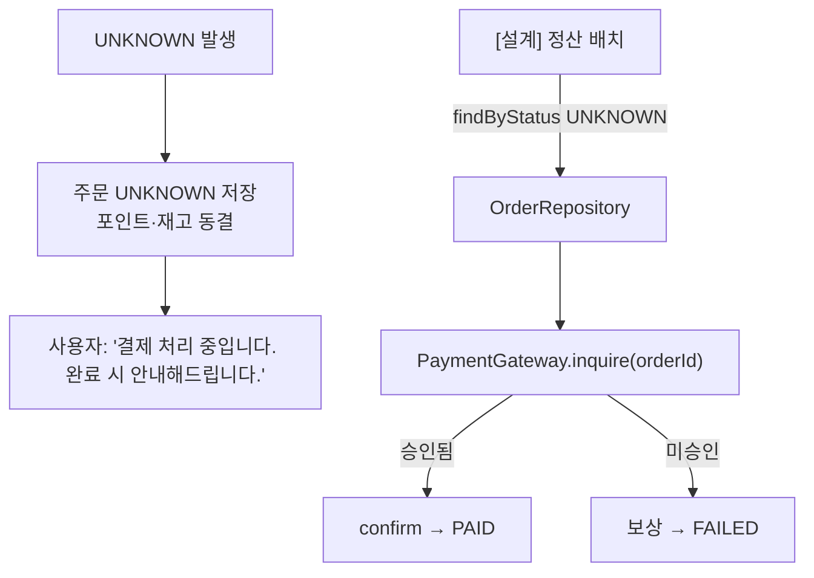

# 결제 설계 (Payment Design)

> **한 줄 요약** — 포인트(내부) 먼저 차감하고 PG(외부) 마지막 호출. 조합 규칙은 PaymentPolicy가 검증. 새 수단 추가는 Gateway 구현체 하나 + Router 등록 한 줄로 끝.

---

## 컴포넌트 구조

```
BookingService
    │
    ▼
PaymentOrchestrator          ← 결제 흐름 총괄 (포인트 보상 책임)
    ├── PaymentPolicy        ← 조합 규칙 검증
    ├── PointProcessor       ← 포인트 차감/환불 (직접 처리)
    └── PaymentGatewayRouter ← PG 수단 선택기
            ├── CardGateway  (mock)
            └── YPayGateway  (mock)
```

### 컴포넌트별 책임

| 컴포넌트 | 책임 | 보상 책임 |
|---|---|---|
| `PaymentOrchestrator` | 흐름 총괄, 포인트 차감 조율 | 자신이 차감한 포인트 환불 |
| `PaymentPolicy` | 조합 규칙 검증 (카드+페이 혼용 불가, 금액 합 검증) | — |
| `PointProcessor` | 포인트 잔액 조회·차감·환불 (DB 트랜잭션) | — |
| `PaymentGatewayRouter` | method → Gateway 매핑 | — |
| `PaymentGateway` (각 구현체) | PG 승인·취소·조회 외부 호출, 재시도 내부 처리 | — |
| `BookingService` | 재고 reserve/confirm/release | 재고 반납 |

**보상 책임 경계**: "차감한 주체가 보상한다". 포인트는 `PaymentOrchestrator`, 재고는 `BookingService`. 둘이 서로 건드리지 않음.

---

## 핵심 원칙

**1. 내부 먼저, 외부 나중**
포인트(내부 DB)를 먼저 차감하고 PG(외부)를 마지막에 호출. PG 취소는 외부 API 재호출이 필요하고 그마저 실패할 수 있어, 실패 시 항상 내부 자원만 되돌리도록 순서를 고정. 이 순서 덕에 PG 취소를 부를 경로가 구조적으로 없음.

**2. 조합 규칙은 PaymentPolicy 단일 책임**
카드+페이 혼용 불가, 금액 합 검증 등 결제 규칙을 PaymentPolicy 한 곳에 집중. 규칙이 BookingService나 Controller에 흩어지면 변경 시 여러 곳 수정 필요 — 수정 포인트 1개로 확보.

**3. 포인트는 Router를 타지 않음**
PaymentGateway 인터페이스는 외부 PG 호출 추상화용. 포인트를 Gateway로 포장하면 외부 네트워크 호출처럼 취급되어 재시도·타임아웃 처리가 맞지 않음. PointProcessor가 DB 트랜잭션으로 직접 처리.

**4. 타임아웃 ≠ 실패 → UNKNOWN 동결**
응답 타임아웃은 PG가 요청을 받았을 수도 있는 불명 상태. 즉시 포인트 환불 시 PG가 실제 승인한 경우 이중 결제 위험. 동결 후 inquire로 확정이 유일하게 안전한 경로.

**5. 재시도는 5xx에만, 타임아웃은 금지**
5xx = PG 미처리 확실 → 재시도 안전. 응답 타임아웃 = 요청이 이미 PG에 도달했을 수 있음 → 재시도 시 이중 승인 위험. 연결 타임아웃(요청 미도달)은 재시도 안전 — Gateway 내부에서 처리.

---

## 결제 수단

### 지원 수단

| 수단 | 타입 | 처리 경로 |
|---|---|---|
| `CREDIT_CARD` | PG (외부) | Router → CardGateway |
| `PAY` | PG (외부) | Router → YPayGateway |
| `Y_POINT` | 내부 | PointProcessor 직접 |

### 조합 규칙 (PaymentPolicy)

```
현금성 PG(카드·페이)는 최대 1개, 포인트는 선택
카드 + 포인트  ✅
페이 + 포인트  ✅
카드 단독      ✅
포인트 단독    ✅
카드 + 페이    ❌  (혼용 불가)
```

```java
// PaymentPolicy 검증 로직 스케치
void validate(List<PaymentLine> lines, long orderAmount) {
    long pgCount = lines.stream()
        .filter(l -> l.method() == CREDIT_CARD || l.method() == PAY)
        .count();
    if (pgCount > 1) throw new InvalidPaymentCombinationException();

    long total = lines.stream().mapToLong(PaymentLine::amount).sum();
    if (total != orderAmount) throw new PaymentAmountMismatchException();
}
```

### 확장성 — 새 수단 추가 시

`BookingService` / `PaymentOrchestrator` 수정 없음. 아래 두 가지만:
1. `PaymentGateway` 구현체 추가
2. `PaymentGatewayRouter`의 Map에 등록 한 줄

---

## 결제 흐름

### 정상 경로




**T1 (로컬 트랜잭션 1)**: 포인트 차감 + `point_transaction(USE)` + 주문·라인 `PENDING` insert  
**T2 (로컬 트랜잭션 2)**: 주문 `PAID` + 결제 `SUCCESS` + `payment_line` insert

### REJECTED — 보상

PG가 `REJECTED`(명확한 거절)이면 앞서 차감한 자원을 역순으로 복원:



PG가 마지막이라 이 경로에서 **PG 취소 호출 없음**. 내부 자원(포인트·재고)만 되돌림.

> **보상 책임 분리**: 포인트 환불과 주문 FAILED 마킹은 `PaymentOrchestrator.handleRejected()`가 수행. 재고 반납과 멱등 키 해제는 호출자인 `BookingFacade`의 catch 블록이 담당. "차감한 주체가 보상한다" 원칙의 엄격한 적용.

### UNKNOWN — 동결 및 조회



- **즉시 실패 처리 금지**: 카드가 실제 승인됐을 수 있어 포인트 즉시 환불 시 이중 결제 위험
- **정산 배치**: 인터페이스·구조 설계만. 실제 배치 잡은 미구현 (PG 연동 생략 범위와 동일)

**실시간 보정 (GET /orders/{orderId})**
status == UNKNOWN이면 즉시 `PaymentGateway.inquire()` 호출해 결과 확정.
승인됨 → confirm + PAID / 미승인 → release + 포인트 환불 + FAILED / 결과 없음 → UNKNOWN 유지.
상세 흐름은 [멱등성 설계](idempotency-design.md#3-unknown-실시간-보정--get-ordersorderid) 참조.

---

## PG 인터페이스

```java
interface PaymentGateway {
    PaymentOutcome approve(PaymentCommand command);
    PaymentOutcome inquire(String orderId);   // UNKNOWN 거래 조회용
    void refund(String orderId);
    PaymentMethod method();                  // Router 등록용
}

// 3-state. 2-state(성공/실패)로는 타임아웃 표현 불가
enum PaymentOutcome {
    APPROVED,   // PG 승인 확정
    REJECTED,   // 사용자 오류 (한도 초과 등) — 재시도 무의미
    UNKNOWN     // 타임아웃 or PG 오류 포기 — 동결 후 inquire
}
```

---

## 재시도 전략

PG 응답 유형별 처리:

| PG 응답 | 원인 | 처리 |
|---|---|---|
| 연결 타임아웃 (요청 미도달) | 네트워크 | 재시도 안전 — Gateway 내부에서 처리 |
| 응답 타임아웃 (요청 도달·응답 유실) | 네트워크/PG | **재시도 금지** → UNKNOWN |
| 4xx (한도 초과 등) | 사용자 오류 | 재시도 없음 → REJECTED |
| 5xx (PG 서버 오류) | PG 내부 | **2회까지 재시도** (exponential backoff) → 그래도 실패 시 UNKNOWN |

재시도 로직은 **Gateway 구현체 내부**에서 처리. `Orchestrator`는 최종 `PaymentOutcome`만 받음.

```
1차 시도 → PG 5xx
  대기 (backoff) → 2차 재시도 → PG 5xx
  대기 (backoff) → 3차 재시도 → PG 5xx
  → UNKNOWN 반환
```
