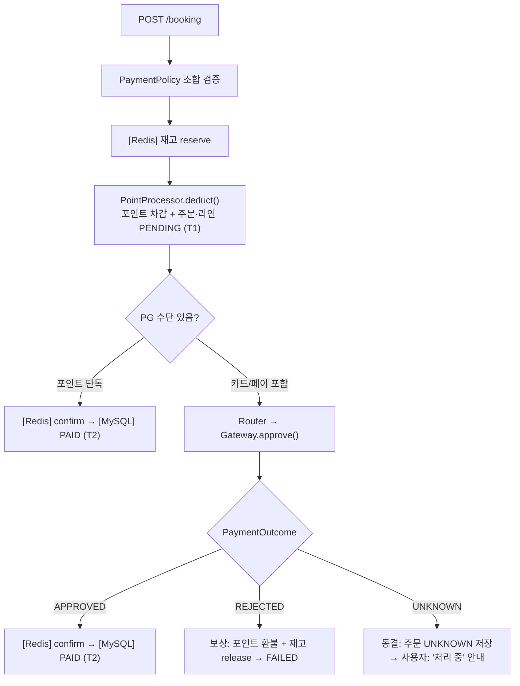
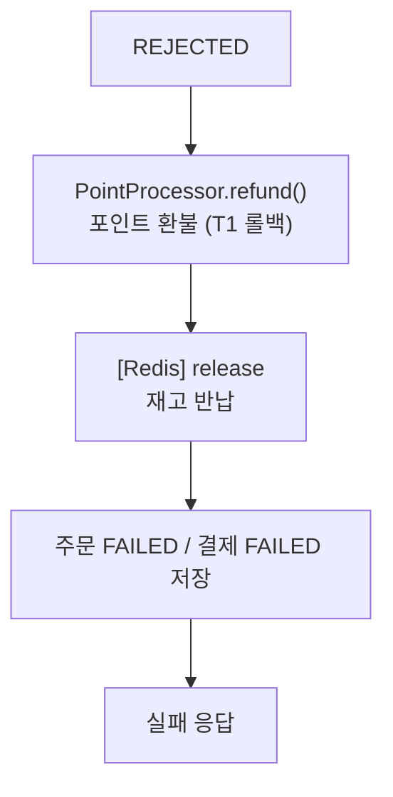
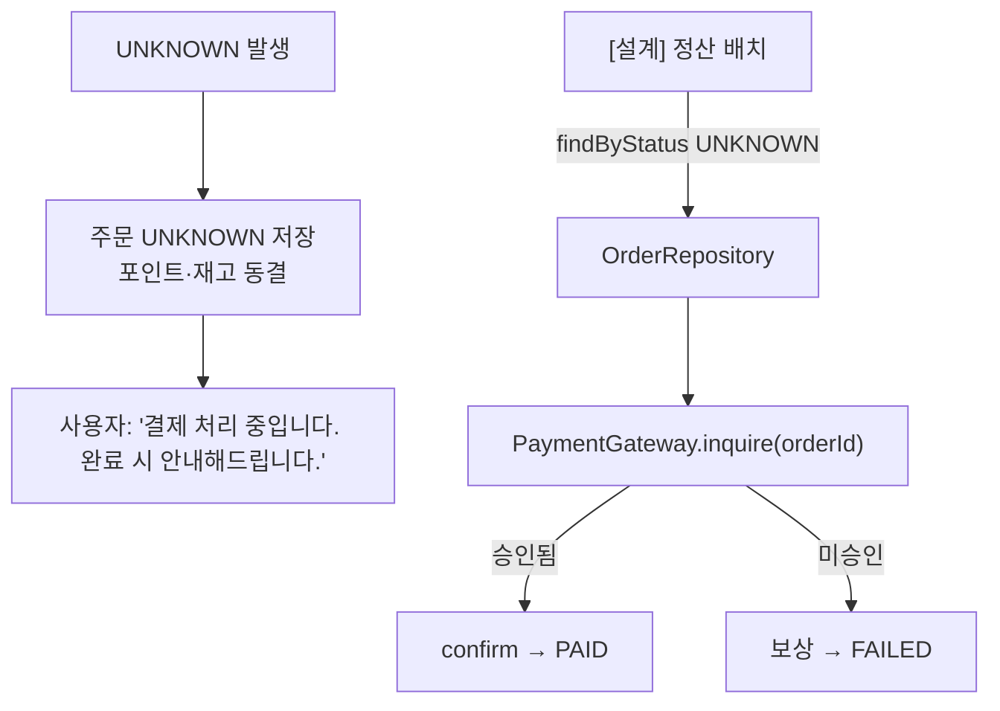

# 결제 설계 (Payment Design)

> **한 줄 요약** — 포인트(내부) 먼저 차감하고 PG(외부) 마지막 호출. 조합 규칙은 PaymentPolicy가 검증. 새 수단 추가는 Gateway 구현체 하나 + Router 등록 한 줄로 끝.

---

## 1. 핵심 원칙

| # | 원칙 |
|---|---|
| 1 | **내부 먼저, 외부 나중** — 되돌리기 쉬운 포인트를 먼저, 되돌리기 어려운 PG를 마지막에 |
| 2 | **조합 규칙은 PaymentPolicy 단일 책임** — 비즈니스 규칙이 레이어 밖으로 새지 않게 |
| 3 | **포인트는 Router를 타지 않는다** — PG가 아닌 내부 자원이므로 PointProcessor가 직접 처리 |
| 4 | **타임아웃 ≠ 실패** — UNKNOWN은 동결 후 inquire로 확정. 즉시 실패 처리 금지 |
| 5 | **재시도는 PG 서버 오류(5xx)에만 2회 제한** — 응답 타임아웃은 이중 결제 위험으로 재시도 금지 |

---

## 2. 컴포넌트 구조

```
BookingService
    │
    ▼
PaymentOrchestrator          ← 결제 흐름 총괄 (포인트 보상 책임)
    ├── PaymentPolicy        ← 조합 규칙 검증
    ├── PointProcessor       ← 포인트 차감/환불 (직접 처리)
    └── PaymentGatewayRouter ← PG 수단 선택기
            ├── CardGateway  (mock)
            └── YPayGateway  (mock)
```

### 컴포넌트별 책임

| 컴포넌트 | 책임 | 보상 책임 |
|---|---|---|
| `PaymentOrchestrator` | 흐름 총괄, 포인트 차감 조율 | 자신이 차감한 포인트 환불 |
| `PaymentPolicy` | 조합 규칙 검증 (카드+페이 혼용 불가, 금액 합 검증) | — |
| `PointProcessor` | 포인트 잔액 조회·차감·환불 (DB 트랜잭션) | — |
| `PaymentGatewayRouter` | method → Gateway 매핑 | — |
| `PaymentGateway` (각 구현체) | PG 승인·취소·조회 외부 호출, 재시도 내부 처리 | — |
| `BookingService` | 재고 reserve/confirm/release | 재고 반납 |

**보상 책임 경계**: "차감한 주체가 보상한다". 포인트는 `PaymentOrchestrator`, 재고는 `BookingService`. 둘이 서로 건드리지 않는다.

---

## 3. 결제 수단 및 조합 규칙

### 3.1 지원 수단

| 수단 | 타입 | 처리 경로 |
|---|---|---|
| `CREDIT_CARD` | PG (외부) | Router → CardGateway |
| `PAY` | PG (외부) | Router → YPayGateway |
| `POINT` | 내부 | PointProcessor 직접 |

### 3.2 조합 규칙 (PaymentPolicy)

```
현금성 PG(카드·페이)는 최대 1개, 포인트는 선택
카드 + 포인트  ✅
페이 + 포인트  ✅
카드 단독      ✅
포인트 단독    ✅
카드 + 페이    ❌  (혼용 불가)
```

```java
// PaymentPolicy 검증 로직 스케치
void validate(List<PaymentLine> lines, long orderAmount) {
    long pgCount = lines.stream()
        .filter(l -> l.method() == CREDIT_CARD || l.method() == PAY)
        .count();
    if (pgCount > 1) throw new InvalidPaymentCombinationException();

    long total = lines.stream().mapToLong(PaymentLine::amount).sum();
    if (total != orderAmount) throw new PaymentAmountMismatchException();
}
```

### 3.3 확장성 — 새 수단 추가 시

`BookingService` / `PaymentOrchestrator` 수정 없음. 아래 두 가지만:
1. `PaymentGateway` 구현체 추가
2. `PaymentGatewayRouter`의 Map에 등록 한 줄

---

## 4. 결제 흐름 (정상 경로)



**T1 (로컬 트랜잭션 1)**: 포인트 차감 + `point_transaction(USE)` + 주문·라인 `PENDING` insert  
**T2 (로컬 트랜잭션 2)**: 주문 `PAID` + 결제 `SUCCESS` + `payment_line` insert

---

## 5. PG 인터페이스

```java
interface PaymentGateway {
    PaymentOutcome approve(PaymentCommand command);
    PaymentOutcome inquire(String orderId);   // UNKNOWN 거래 조회용
    void refund(String orderId);
    PaymentMethod method();                  // Router 등록용
}

// 3-state. 2-state(성공/실패)로는 타임아웃 표현 불가
enum PaymentOutcome {
    APPROVED,   // PG 승인 확정
    REJECTED,   // 사용자 오류 (한도 초과 등) — 재시도 무의미
    UNKNOWN     // 타임아웃 or PG 오류 포기 — 동결 후 inquire
}
```

---

## 6. 재시도 전략

PG 응답 유형별 처리:

| PG 응답 | 원인 | 처리 |
|---|---|---|
| 연결 타임아웃 (요청 미도달) | 네트워크 | 재시도 안전 — Gateway 내부에서 처리 |
| 응답 타임아웃 (요청 도달·응답 유실) | 네트워크/PG | **재시도 금지** → UNKNOWN |
| 4xx (한도 초과 등) | 사용자 오류 | 재시도 없음 → REJECTED |
| 5xx (PG 서버 오류) | PG 내부 | **2회까지 재시도** (exponential backoff) → 그래도 실패 시 UNKNOWN |

재시도 로직은 **Gateway 구현체 내부**에서 처리. `Orchestrator`는 최종 `PaymentOutcome`만 받는다.

```
1차 시도 → PG 5xx
  대기 (backoff) → 2차 재시도 → PG 5xx
  대기 (backoff) → 3차 재시도 → PG 5xx
  → UNKNOWN 반환
```

---

## 7. 결제 실패 — 보상

PG가 `REJECTED`(명확한 거절)이면 앞서 차감한 자원을 역순으로 복원:



PG가 마지막이라 이 경로에서 **PG 취소 호출 없음**. 내부 자원(포인트·재고)만 되돌린다.

---

## 8. UNKNOWN — 동결 및 조회



- **즉시 실패 처리 금지**: 카드가 실제 승인됐을 수 있어 포인트 즉시 환불 시 이중 결제 위험
- **정산 배치**: 인터페이스·구조 설계만. 실제 배치 잡은 미구현 (PG 연동 생략 범위와 동일)

---

## 9. 결정 요약

| 쟁점 | 결정 | 근거 |
|---|---|---|
| 조합 규칙 검증 위치 | `PaymentPolicy` (결제 서비스 내) | 비즈니스 규칙이 예약 도메인으로 새지 않게, 규칙 변경 시 한 곳만 수정 |
| 포인트 차감 순서 | PG 호출 전 (내부 먼저) | PG 취소(외부 호출) 없이 내부 보상만으로 정리 가능 |
| 포인트 Router 경유 여부 | 직접 (PointProcessor) | 포인트는 외부 PG가 아닌 내부 자원 — Gateway로 포장하면 억지 |
| UNKNOWN 처리 | 동결 + inquire (배치 미구현) | 즉시 실패 처리 시 이중 결제 위험, PG 연동 생략 범위와 일치 |
| PG 재시도 | 5xx에만 2회, 타임아웃은 금지 | 응답 타임아웃 재시도 = 이중 결제 위험 |
| 결제수단 확장 | Gateway 구현체 + Router 등록만 | OCP — Booking/Orchestrator 수정 없이 수단 추가 |
