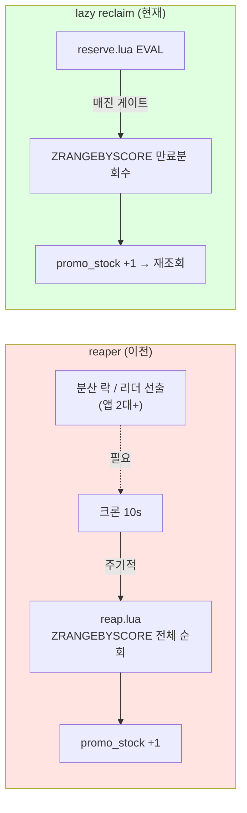
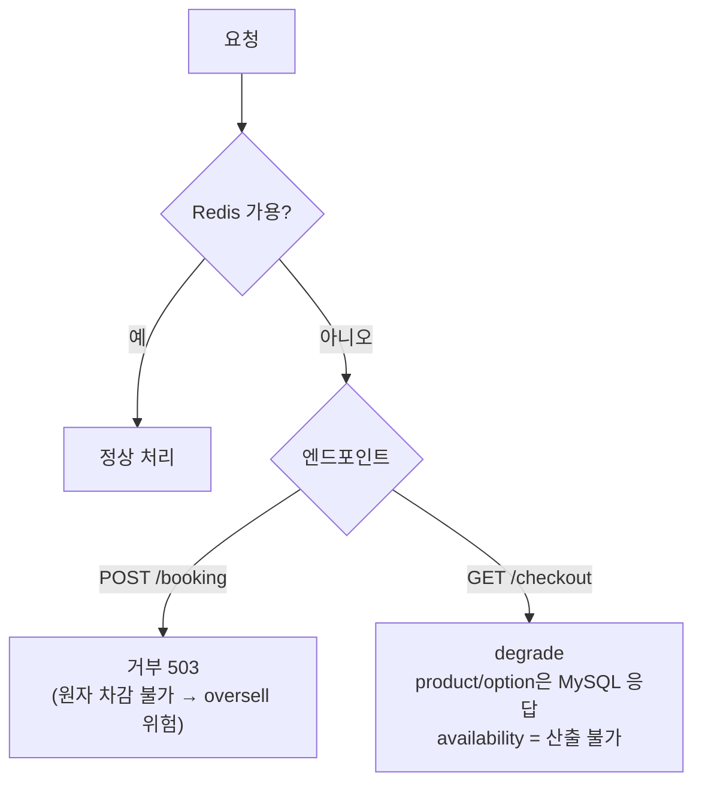
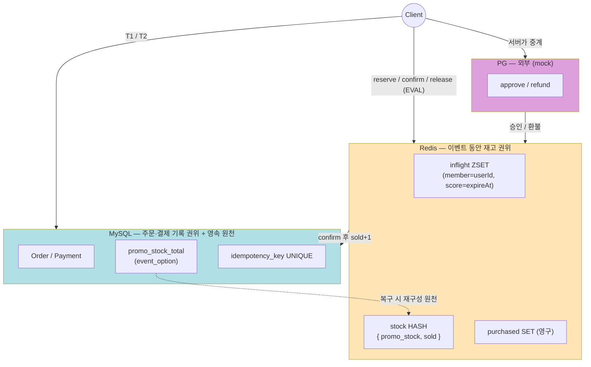
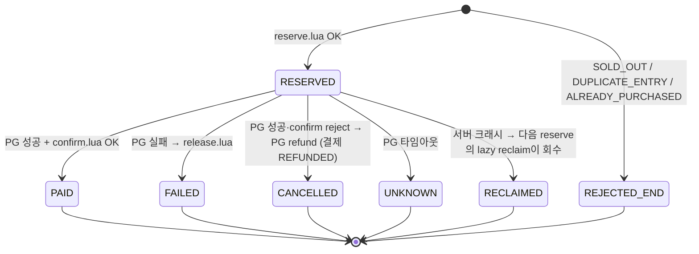

# 재고 설계 (Stock Design)

> **한 줄 요약** — 재고 권위는 이벤트 동안 Redis가 들고, 만료된 점유의 회수 책임은 별도 크론이 아니라 `reserve.lua` 안으로 접는다 (lazy reclaim).

본 문서는 선착순 예약/결제 시스템의 재고 메커니즘 단일 권위다. 흐름(booking)·결제(payment)·도메인(product-event) 문서가 재고 디테일을 참조할 때는 이 문서를 가리킨다.

흐름은 [booking-flow.md](booking-flow.md), 도메인·재고 정책 원천은 [product-event-design.md](product-event-design.md), 결제는 [payment-flow.md](payment-flow.md) 참조.

핵심 원칙:

| # | 원칙 |
|---|---|
| 1 | 재고 권위 = Redis(이벤트 동안), 주문·결제 기록 권위 = MySQL, `promo_stock_total`은 MySQL 영속 |
| 2 | 만료 점유 회수는 주기적 크론이 아니라 `reserve.lua` 내부에서 처리한다 (lazy reclaim) |
| 3 | 모든 회수가 `reserve`의 원자 `EVAL` 안에서 일어나므로 앱 서버가 N대여도 추가 분산 락·리더 선출이 필요 없다 |
| 4 | 불일치는 항상 under-sell(Order PENDING 고착) 또는 환불(CANCELLED·REFUNDED) 방향으로만, oversell(불가역)은 금기 |

---

## 1. 재고 모델 (2-state)

| 카운터 | 의미 |
|---|---|
| `promo_stock` | 사용 가능한 promo 재고 |
| `sold` | 결제 완료된 자리 |

"결제 진행 중" 수는 별도 카운터를 두지 않고 `ZCARD inflight`로 본다. `reserved` 카운터는 두지 않는다.

불변식:

```
promo_stock + sold + ZCARD(inflight) = promo_stock_total (초기 재고)
```

`promo_stock_total`은 MySQL `event_option`에 영속되는 유일한 재고 원천이다 ([product-event-design.md §3.2](product-event-design.md) 참조). 실시간 카운터(`promo_stock`, `sold`)와 `inflight`는 Redis에 산다.

---

## 2. Redis 키 구조

| 키 | 타입 | 역할 |
|---|---|---|
| `stock:event:{e}:option:{o}` | HASH `{ promo_stock, sold }` | 재고 2-state 카운터 |
| `inflight:event:{e}:option:{o}` | ZSET (member = `userId`, score = `expireAt ms`) | 결제 진행 중 자리 추적 + 1인 1구매 동시 락 겸용 + lazy reclaim 회수 원천 |
| `purchased:event:{e}` | SET (member = `userId`) | 결제 완료자 영구 차단 |

`inflight` ZSET은 score에 만료시각(`expireAt ms`)을 들고 있다. 즉 "누가 죽었는지(만료됐는지)" 판단 정보가 데이터 안에 이미 들어 있다. lazy reclaim은 이 score를 회수 기준으로 쓴다.

---

## 3. Lua 스크립트

전부 atomic. 모든 Redis 분기 결정은 Lua 안에서 끝낸다. Redis `EVAL`은 스크립트 전체를 중단 없이 직렬 실행하므로, 검사와 차감 사이에 다른 서버의 요청이 끼어드는 race가 발생하지 않는다.

### 3.1 reserve.lua — POST /booking 진입 시 (lazy reclaim 포함)

```
-- KEYS: purchased, inflight, stock / ARGV: userId, expireAtMs, nowMs

-- 1) 구매 완료자 차단
if SISMEMBER purchased userId == 1 then return ALREADY_PURCHASED end

-- 2) 동일 유저 결제중 차단 — 단, "만료되지 않은" 경우만
local myScore = ZSCORE inflight userId
if myScore ~= false then
    if tonumber(myScore) > nowMs then
        return DUPLICATE_ENTRY          -- 아직 유효한 결제중 → 중복 차단
    end
    -- 내 만료 엔트리 = 이전 시도 잔해 → 인라인 회수 후 진행 (lockout 방지)
    ZREM inflight userId
    HINCRBY stock promo_stock 1
end

-- 3) 재고 확인 + lazy reclaim (매진처럼 보일 때만 남의 만료분 일괄 회수)
local stock = HGET stock promo_stock
if stock == false or tonumber(stock) <= 0 then
    local expired = ZRANGEBYSCORE inflight 0 nowMs
    for each member in expired:
        if ZREM inflight member == 1 then
            HINCRBY stock promo_stock 1
        end
    stock = HGET stock promo_stock      -- 회수 후 재조회
end
if stock == false or tonumber(stock) <= 0 then return SOLD_OUT end

-- 4) 차감 + inflight 등록
HINCRBY stock promo_stock -1
ZADD inflight expireAtMs userId
return OK
```

두 종류의 회수(내 만료분 / 남의 만료분)는 §4에서 상세히 구분한다.

### 3.2 confirm.lua — PG 승인 후

```
-- KEYS: inflight, stock, purchased / ARGV: userId

-- inflight에 userId 없으면 → lazy reclaim이 먼저 회수한 병리 케이스
if ZSCORE inflight userId == false then return REJECTED_NEED_REFUND end

HINCRBY stock sold 1        -- MySQL T2보다 먼저 → 이 시점부터 회수 불가 (oversell 원천 0)
SADD purchased userId
ZREM inflight userId
return OK
```

`sold+1`을 MySQL T2(`Order=PAID`)보다 **먼저** 반영한다. 이 시점부터 해당 자리는 lazy reclaim이 회수할 수 없다 (`inflight`에서 빠졌으므로). T2 commit 전 서버가 죽어도 oversell이 발생하지 않는 근거가 여기에 있다.

`REJECTED_NEED_REFUND` 가드는 안전망이다. TTL 90s ≫ PG timeout 30s라 실제로는 거의 안 타지만, lazy reclaim이 내 `inflight`를 쓸어간 병리적 케이스에 대비한다. 발생 시 호출부가 PG refund 후 주문을 CANCELLED·결제를 REFUNDED로 마감한다 — "드문 환불 ≪ oversell"의 의도적 선택.

### 3.3 release.lua — PG 실패·예외 시 (현재 파일명 `compensate.lua`)

```
-- KEYS: inflight, stock / ARGV: userId

local removed = ZREM inflight userId
if removed == 1 then
    HINCRBY stock promo_stock 1     -- 실제 제거됐을 때만 복원
end
return OK
```

`ZREM == 1`(실제 제거)일 때만 `promo_stock +1`. 0이면 이미 `inflight`에 없는 상태(lazy reclaim이 먼저 회수했거나 이중 호출)이므로 복원하지 않는다. 이 가드가 이중 복원을 막아 oversell을 차단한다.

---

## 4. lazy reclaim 상세

만료된 `inflight` 엔트리는 서버 크래시·프로세스 사망 등으로 `confirm`/`release`가 끝내 호출되지 못한 점유의 잔해다. 이걸 회수하지 않으면 재고가 잠기고(under-sell), 해당 유저는 중복 검사에 영원히 걸린다(lockout). 회수 책임을 별도 크론이 아니라 `reserve.lua` 안으로 접는다.

핵심 통찰: under-sell은 **재고가 모자랄 때만** 문제다. 그리고 재고를 요청하는 주체가 바로 `reserve`다. 따라서 "재고가 필요한 그 순간"에 회수하면 타이밍이 정확히 일치한다 — 주기적으로 ZSET 전체를 순회할 이유가 없다.

### 4.1 두 종류의 회수

| 종류 | 시점 | 비용 | 없으면 생기는 버그 |
|---|---|---|---|
| **내 만료분 (인라인, 항상)** | step 2의 `ZSCORE` 검사에서 내 엔트리가 만료(`score ≤ nowMs`)됐으면 즉시 `ZREM` + `promo_stock +1` | 0 (이미 `ZSCORE` 호출 중) | 이전 시도 잔해 때문에 본인이 `DUPLICATE_ENTRY`로 **영구 lockout** |
| **남의 만료분 (일괄, 게이트)** | `promo_stock <= 0`으로 매진처럼 보일 때만 `ZRANGEBYSCORE inflight 0 nowMs`로 일괄 회수 후 재고 재조회 | `ZRANGEBYSCORE` 1회 + 회수 건수만큼 `ZREM`/`HINCRBY` | 만료 잔해가 자리를 묶어 **under-sell** (회수 가능한 재고를 SOLD_OUT으로 오판) |

### 4.2 게이트 근거 — "필요할 때만 비용 지불"

남의 만료분 일괄 회수는 `promo_stock <= 0` 게이트 뒤에 둔다. 평시 fast-path(재고 있음)는 이 블록을 안 타므로 500~1000 TPS에서도 쓸데없는 `ZRANGEBYSCORE`를 날리지 않는다. ZSET 전체 순회 비용은 정말 매진처럼 보일 때만 한 번 지불한다.

일괄 회수 시 `ZREM == 1`일 때만 `HINCRBY +1`로 복원한다 (release.lua와 동일 가드). `confirm`이 같은 member를 먼저 가져갔다면 `ZREM == 0`이 되어 이중 복원이 차단된다.

### 4.3 reaper → lazy reclaim 전후 비교

이전 설계는 만료 엔트리를 별도 크론 스케줄러(reaper, 10s 주기)가 `reap.lua`로 회수했다. 이를 폐기하고 lazy reclaim으로 전환한다. (`reap.lua`, `InflightReaper` scheduler는 폐기 대상이다 — 코드 정리는 별도 진행.)

| 항목 | reaper (이전) | lazy reclaim (현재) |
|---|---|---|
| 회수 트리거 | 시간 (10s 주기 크론) | 수요 (`reserve` 진입 + 매진 게이트) |
| 분산 환경 (앱 2대+) | 양쪽 크론이 같은 만료분을 동시 회수 → 리더 선출·분산 락 필요 | `reserve`의 원자 `EVAL` 안에서 회수 → 추가 락 불필요 |
| 평시 비용 | 정상 흐름에 무관한 컴포넌트가 10s마다 ZSET 순회 | fast-path는 회수 블록 미진입 (비용 0) |
| 구성요소 | scheduler + `reap.lua` 추가 | `reserve.lua` 내부에 흡수 (부품 감소) |
| under-sell 방지 | 주기적 순회로 보장 | 재고 필요 시점에 정확히 회수 |



reaper의 문제 두 가지가 lazy reclaim에서 동시에 사라진다: (1) 분산 환경에서 양쪽 크론의 동시 회수 race → 분산 락이 또 필요한 "복잡성이 복잡성을 부르는" 구조, (2) 정상 흐름엔 아무 일도 안 하지만 없으면 안 되는 어정쩡한 컴포넌트.

---

## 5. TTL

| 항목 | 값 | 근거 |
|---|---|---|
| `inflight` ZSET score | `nowMs + 90000` (90s) | PG client timeout 30s + 여유 60s |

TTL을 PG timeout보다 넉넉히 잡아 "결제 중 만료" race를 원천 차단한다. 결제가 아직 진행 중인데 score가 지나 lazy reclaim이 자리를 회수해버리는 상황을 막는다. 이 여유 덕분에 §3.2의 `REJECTED_NEED_REFUND` 분기는 서버 크래시 같은 극단적 상황에서만 발생한다.

---

## 6. 분산 환경 정합성 (EVAL 원자성)

Redis `EVAL`은 Lua 스크립트 전체를 중단 없이 원자 실행한다. lazy reclaim의 회수가 `reserve`의 원자 `EVAL` 안에서 일어나므로, 앱 서버가 2대든 N대든 추가 분산 락·리더 선출이 필요 없다.

이것이 reaper 대비 가장 큰 이점이며, "서버 2대 이상 분산 환경" 요건과 직결된다. reaper였다면 양쪽 서버의 크론이 같은 만료 엔트리를 동시에 회수하려는 race를 막기 위해 리더 선출이나 분산 락을 또 도입해야 했다. lazy reclaim은 회수를 재고 차감과 같은 원자 단위로 묶어 이 문제를 구조적으로 소거한다.

---

## 7. Redis 장애 대응 — fail-closed

Redis 연결 실패로 `reserve.lua` `EVAL`이 불가하면 **POST /booking을 거부한다 (503/에러).**

근거:

- Redis 없이는 원자적 재고 차감을 보장할 수 없다 → oversell 위험을 감수하느니 거부한다. **정합성 > 가용성**, 과제 철학(oversell 절대 금기)과 일관.
- 인프라 증설이 제한적이라는 전제와도 맞물려, 무리한 DB 폴백으로 핫패스에 락 경합을 만들기보다 깔끔히 fail-closed한다.

`GET /checkout`은 부수효과가 없으므로 degrade 가능하다. 상품 정보는 MySQL에서 응답하되 `availability`는 산출 불가로 표기한다. 점유 결정은 어차피 POST에서만 일어나므로 영향이 작다.



---

## 8. Redis 복구 — 보수적 재구성

Redis 데이터 유실(크래시·페일오버·영속 없는 재시작) 후 상태를 재구성하는 절차다.

### 8.1 핵심 함정 — sold = COUNT(PAID)로 세면 oversell

우리 설계는 Redis-first finality라 `confirm.lua`의 `sold+1`이 MySQL T2(`Order=PAID`)보다 **먼저** 일어난다. 그래서 "confirm 직후 ~ T2 commit 전" 사이에 Redis가 유실되면 그 주문은 MySQL에 PAID가 아니라 **PENDING**으로 남는다.

만약 복구 시 `sold = COUNT(PAID)`로만 세면 이 건이 누락된다 → `promo_stock`이 과다 산정 → 그 자리를 또 판다 → **oversell**.

### 8.2 해법 — 비-실패 주문을 모두 sold로 센다

| 항목 | 재구성 방법 |
|---|---|
| `sold` | `COUNT(orders WHERE event/option 매칭 AND status IN (PAID, PENDING, UNKNOWN))` — 자리를 점유 중인 모든 비-실패 주문을 센다 |
| `promo_stock` | `promo_stock_total − sold` (`promo_stock_total`은 MySQL `event_option`에 영속, [product-event-design.md §3.2](product-event-design.md)) |
| `purchased` SET | 위 점유 주문들의 `userId`로 재구성 (`SADD`) |
| `inflight` ZSET | 비운다 — 휘발 정보라 재구성하지 않는다 |

`sold`에 PENDING·UNKNOWN까지 포함하므로 최악이 under-sell(PENDING 고착분이 자리를 묶음)이고 oversell은 0이다. 의도적으로 보수적인 방향을 택한다.

유실된 `inflight` 건은 각자 POST 요청 수명에서 `confirm`/`release`로 해소되거나, UNKNOWN으로 남아 거래조회([payment-flow.md §6](payment-flow.md)) 대상이 된다.

이 재구성은 운영 절차·설계 차원이다. 과제는 PG 연동·배치를 미구현 범위로 두므로 인터페이스·쿼리로 구조만 잇고, 실제로 도는 배치 잡으로 만들지는 않는다 ([payment-flow.md](payment-flow.md)의 정산 대사 서술과 톤 일치).

---

## 9. 권위 경계 — Redis vs MySQL vs PG



권위 경계:

- **Redis** = 이벤트 동안 재고 권위.
- **MySQL** = 주문·결제 기록 권위 + `promo_stock_total`·`idempotency_key` UNIQUE의 영속 원천(복구 시 재구성 기준).
- **PG** = 외부(mock).

불일치는 항상 "Order PENDING 고착"(under-sell) 또는 "환불 시 CANCELLED·REFUNDED" 방향으로만 발생시키고, oversell(불가역) 방향은 금기다.

---

## 10. 재고·상태 전이

| 시점 | 재고 전이 | 회수 주체 |
|---|---|---|
| POST /booking 시작 (`reserve.lua`) | `promo_stock −1`, `ZADD inflight userId` | — |
| 결제 성공 (`confirm.lua`) | `sold +1`, `ZREM inflight userId` | — |
| 결제 실패·예외 (`release.lua`) | `promo_stock +1`, `ZREM inflight userId` | 호출부 |
| 내 이전 시도 잔해 (`reserve.lua` step 2) | `promo_stock +1`, `ZREM inflight userId` | 인라인 lazy reclaim (항상) |
| 서버 크래시 후 남의 잔해 (`reserve.lua` step 3) | `promo_stock +1`, `ZREM inflight member` | 일괄 lazy reclaim (매진 게이트) |

한 POST /booking의 생애:



---

## 11. 선택 근거 종합

### 11.1 lazy reclaim — 회수를 reserve 안으로

reaper(주기적 크론)를 폐기하고 만료 회수 책임을 `reserve.lua`로 접는다.

근거:

- under-sell은 재고가 모자랄 때만 문제이고, 재고를 요청하는 주체가 `reserve`다 → "재고 필요 시점 = 회수 시점"이 정확히 일치.
- 분산 환경에서 양쪽 크론의 동시 회수 race가 구조적으로 사라짐 (회수가 원자 `EVAL` 안) → 분산 락·리더 선출 불필요.
- 정상 흐름에 무관하지만 없으면 안 되던 컴포넌트(scheduler + `reap.lua`)를 소거.

### 11.2 두 종류 회수 분리 — 인라인(항상) vs 일괄(게이트)

근거:

- 내 만료분은 `ZSCORE` 검사 중에 공짜로 발견되므로 항상 즉시 회수 → 잔해로 인한 본인 영구 lockout 차단.
- 남의 만료분은 `promo_stock <= 0` 게이트 뒤에 둬 평시 fast-path가 `ZRANGEBYSCORE`를 안 타게 함 → "필요할 때만 비용 지불".

### 11.3 oversell 0 — Redis 원자 차감 + Redis-first finality

근거:

- `reserve.lua`가 `HGET promo_stock` 가드 + `HINCRBY -1`을 한 `EVAL`로 묶어 다중 TPS에서도 직렬 처리.
- `confirm.lua`로 `sold+1`이 MySQL T2보다 먼저 → 이미 팔린 자리는 lazy reclaim이 회수 불가.
- 불일치는 "Order PENDING 고착"(under-sell) 방향으로만 발생, oversell(불가역)은 금기.

### 11.4 TTL 90s ≫ PG timeout 30s

근거:

- 결제가 진행 중인데 score가 지나 lazy reclaim이 자리를 회수하는 race를 원천 차단.
- 이 여유 덕에 `confirm.lua`의 `REJECTED_NEED_REFUND`는 병리적 경로에서만 발생 → "드문 환불 ≪ oversell".

### 11.5 fail-closed + 보수적 복구

근거:

- Redis 장애 시 POST 거부 → 원자 차감을 못 하면 oversell보다 거부를 택함 (정합성 > 가용성).
- 복구 시 `sold`에 PENDING·UNKNOWN까지 포함 → Redis-first finality로 인한 "PAID 미반영" 누락을 보수적으로 흡수, 최악이 under-sell이고 oversell은 0.
