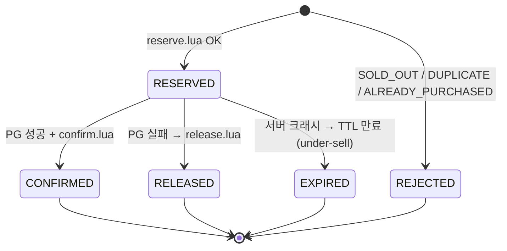
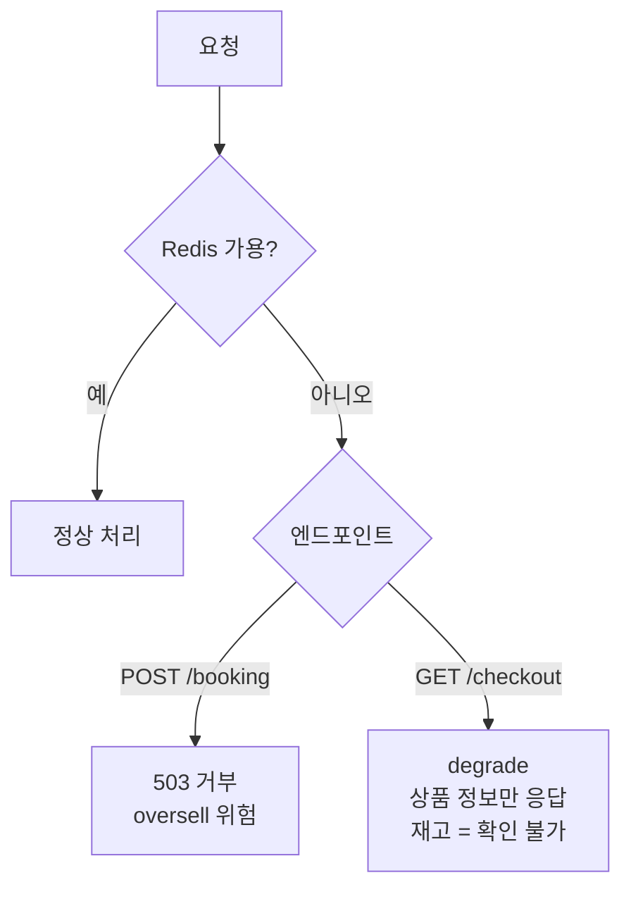

# 재고 설계 (Stock Design)

> **한 줄 요약** — 재고 권위는 이벤트 동안 Redis가 들고, 원자적 Lua로 oversell을 원천 차단한다. 단순성을 위해 서버 크래시로 인한 under-sell은 허용 범위로 본다.

---

## 1. 설계 원칙

| # | 원칙 |
|---|---|
| 1 | 재고 권위 = Redis (이벤트 동안), 주문·결제 기록 권위 = MySQL |
| 2 | oversell(초과판매)은 절대 금기. under-sell(크래시 시 소수 잠김)은 허용 |
| 3 | 모든 재고 차감은 Lua EVAL 안에서 원자적으로 처리 — 앱 서버 N대여도 추가 분산 락 불필요 |
| 4 | 단순성 우선 — lazy reclaim·ZSET 순회 없이 단순 key + TTL로 inflight 관리 |

---

## 2. Redis 키 구조

| 키 | 타입 | 역할 |
|---|---|---|
| `stock:event:{e}:option:{o}` | HASH `{ promo_stock, sold }` | 재고 2-state 카운터 |
| `inflight:event:{e}:option:{o}:user:{u}` | String (TTL 90s) | 결제 진행 중 락 (1인 1구매 동시 차단) |
| `purchased:event:{e}` | SET (member = userId) | 결제 완료자 영구 차단 |

### TTL 90s 근거
PG client timeout 30s + 여유 60s. 결제가 진행 중인데 key가 만료되어 다른 요청이 통과하는 race를 원천 차단한다.

---

## 3. Lua 스크립트

전부 atomic. Redis EVAL은 스크립트 전체를 중단 없이 직렬 실행하므로 검사와 차감 사이에 다른 서버의 요청이 끼어드는 race가 없다.

### 3.1 reserve.lua — POST /booking 진입 시

```lua
-- KEYS: purchased, inflight, stock
-- ARGV: userId, ttlSeconds

-- 1) 구매 완료자 차단
if redis.call('SISMEMBER', KEYS[1], ARGV[1]) == 1 then
    return 'ALREADY_PURCHASED'
end

-- 2) 동일 유저 결제 중 차단
if redis.call('EXISTS', KEYS[2]) == 1 then
    return 'DUPLICATE_ENTRY'
end

-- 3) 재고 확인
local stock = redis.call('HGET', KEYS[3], 'promo_stock')
if stock == false or tonumber(stock) <= 0 then
    return 'SOLD_OUT'
end

-- 4) 차감 + inflight 등록
redis.call('HINCRBY', KEYS[3], 'promo_stock', -1)
redis.call('SET', KEYS[2], '1', 'EX', tonumber(ARGV[2]))
return 'OK'
```

### 3.2 confirm.lua — PG 승인 후

```lua
-- KEYS: inflight, stock, purchased
-- ARGV: userId

-- inflight key가 존재할 때만 confirm 진행 (DEL 먼저 → 멱등 가드)
local removed = redis.call('DEL', KEYS[1])
if removed == 0 then
    return 'ALREADY_CONFIRMED'  -- 이미 처리됨 (재시도 or 이중 호출)
end

redis.call('HINCRBY', KEYS[2], 'sold', 1)   -- MySQL T2보다 먼저 → oversell 원천 차단
redis.call('SADD', KEYS[3], ARGV[1])
return 'OK'
```

**멱등 가드**: `DEL`을 먼저 실행해 실제로 삭제된 경우(1)에만 `sold+1`을 수행한다. 네트워크 이슈로 confirm이 재시도되어도 두 번째 호출은 `DEL == 0`으로 즉시 반환 → `sold` 이중 증가 차단. `release.lua`와 동일한 패턴으로 일관성을 맞춘다.

`sold+1`을 MySQL T2(`Order=PAID`)보다 **먼저** 반영한다. 이 시점부터 해당 자리는 다른 요청이 가져갈 수 없다. T2 commit 전 서버가 죽어도 oversell이 발생하지 않는 근거가 여기에 있다.

### 3.3 release.lua — PG 실패·예외 시

```lua
-- KEYS: inflight, stock

local removed = redis.call('DEL', KEYS[1])
if removed == 1 then
    redis.call('HINCRBY', KEYS[2], 'promo_stock', 1)
end
return 'OK'
```

`DEL == 1`(실제 삭제)일 때만 `promo_stock +1`. 이미 TTL 만료로 사라졌거나 이중 호출이면 복원하지 않아 이중 복원(→ oversell)을 차단한다.

---

## 4. 재고 전이

| 시점 | 전이 |
|---|---|
| POST /booking 진입 (`reserve.lua`) | `promo_stock −1`, inflight key SET (TTL 90s) |
| 결제 성공 (`confirm.lua`) | `sold +1`, inflight key DEL, purchased SADD |
| 결제 실패·예외 (`release.lua`) | `promo_stock +1`, inflight key DEL |
| 서버 크래시 | inflight key TTL 90s 후 자동 만료 → promo_stock **미복원** (under-sell 허용) |



---

## 5. 서버 크래시 시 under-sell 허용 근거

서버 크래시로 `confirm`/`release`가 호출되지 못하면 inflight key는 TTL 90s 후 자동 만료된다. 이때 `promo_stock`은 복원되지 않아 해당 자리가 잠긴다(under-sell).

**허용하는 이유:**
- oversell(돈 받고 자리 없음, 불가역)보다 under-sell(자리가 잠겼지만 MySQL orders로 확인 후 운영 정리 가능)이 낫다
- 10개 한정 상품에서 서버 크래시는 극히 드문 케이스
- 복잡한 lazy reclaim(ZSET 순회 + 만료 회수 로직)을 도입하지 않아 reserve.lua가 단순하게 유지됨

MySQL `orders` 테이블에 `PENDING` 상태로 남은 주문을 통해 잠긴 재고를 사후 확인·정리할 수 있다.

---

## 6. 1인 1구매 보장 (공정성)

"모든 사용자에게 동등한 기회"를 **1인 1구매**로 해석한다. 한 계정이 여러 자리를 선점하면 다른 사용자의 기회가 구조적으로 줄어들기 때문이다.

2계층으로 강제:

| 계층 | 수단 | 역할 |
|---|---|---|
| 1차 (Redis) | `purchased` SET + `inflight` key | 실시간 차단 (빠른 경로) |
| 2차 (MySQL) | `orders` 조회 | Redis 유실 시 사후 검증 원천 |

---

## 7. Redis 장애 대응 — fail-closed

Redis 연결 실패로 Lua EVAL이 불가하면 **POST /booking을 거부한다 (503).**

근거: Redis 없이는 원자적 재고 차감을 보장할 수 없다. oversell 위험을 감수하느니 거부가 낫다. **정합성 > 가용성.**

`GET /checkout`은 부수효과가 없으므로 degrade 가능하다. 상품 정보는 MySQL에서 응답하되 재고 가용 여부는 "확인 불가"로 표기한다.



---

## 8. 이벤트 시작 시 Redis 시딩 — ShedLock

00시 오픈 직전, `promo_stock_total`(MySQL)을 Redis로 seed해야 재고 차감이 가능하다. 앱 서버가 2대 이상이므로 양쪽이 동시에 seed를 시도할 수 있다.

**ShedLock 도입 이유**: Spring `@Scheduled`만 쓰면 서버 2대가 동시에 같은 스케줄을 실행 → 재고가 두 번 초기화될 위험. ShedLock이 Redis에 분산 락을 잡아 **단 한 대만 실행**하도록 보장한다.

```
매 분 정각 실행 (cron)
  └── ShedLock 분산 락 획득 (1대만 통과)
        └── DB에서 "10분 내 시작 예정" 이벤트 조회
              └── Redis HSETNX로 시드 (이미 시드됐으면 skip)
                    └── 시작 시각 도달 시 event.status = OPEN
```

`HSETNX`(있으면 안 씀)를 사용해 서버 재시작·중복 실행 시에도 기존 재고를 덮어쓰지 않는다.

| ShedLock 옵션 | 값 | 의미 |
|---|---|---|
| `lockAtMostFor` | 2분 | 서버 다운 시 락 자동 해제 (다음 서버가 이어받음) |
| `lockAtLeastFor` | 10초 | 빠른 완료 후에도 중복 실행 방지 |

## 9. 분산 환경 정합성

Redis EVAL은 Lua 스크립트 전체를 원자 실행한다. 앱 서버가 2대든 N대든 `reserve.lua`의 재고 확인 + 차감이 한 EVAL 안에 있으므로 추가 분산 락이 필요 없다.

---

## 9. Redis 복구 — 보수적 재구성

Redis 데이터 유실 후 재구성:

| 항목 | 재구성 방법 |
|---|---|
| `promo_stock` | `promo_stock_total − COUNT(orders WHERE status IN (PAID, PENDING))` |
| `sold` | `COUNT(orders WHERE status = PAID)` |
| `purchased` SET | PAID/PENDING 주문의 userId로 재구성 |
| `inflight` key | 재구성하지 않음 (TTL 휘발 정보) |

PENDING까지 포함해 보수적으로 계산 → 최악이 under-sell, oversell은 0.
